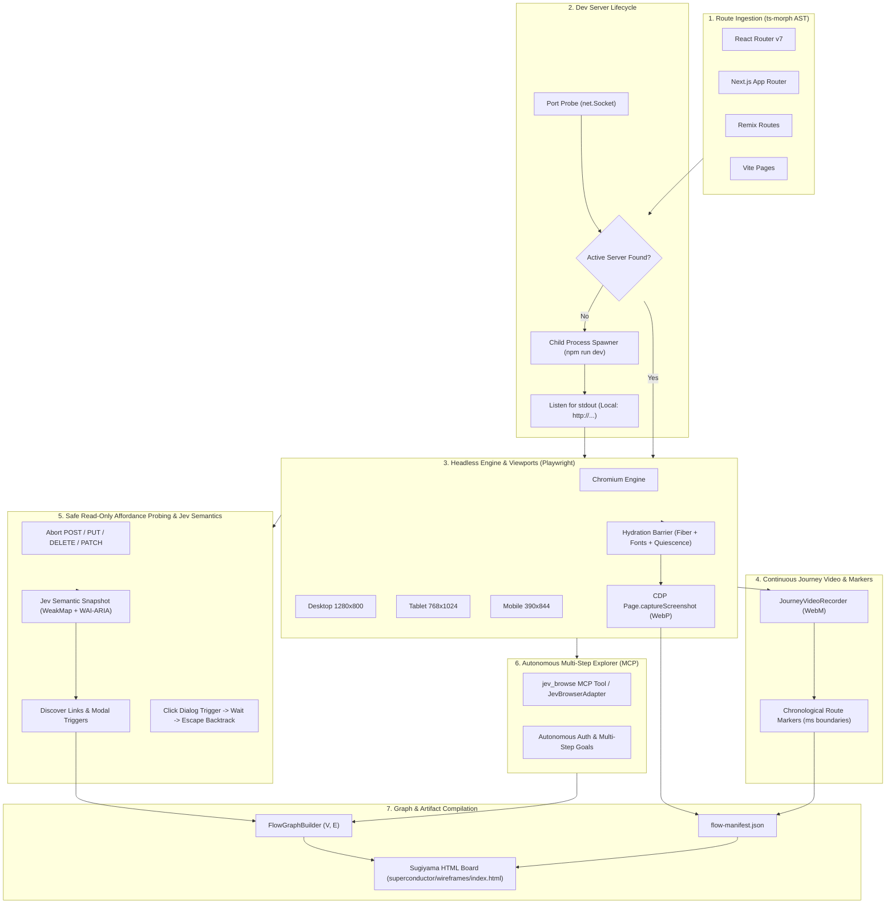

# Automated App Wireframe & Route Flow Crawler

The **Automated App Wireframe & Route Flow Crawler** is a pipeline in Superconductor designed to reverse-engineer running web applications into interactive visual wireframe graphs, multi-viewport screenshot matrices, and time-synchronized video user journeys.

It allows AI agents and developers to audit, verify, and visualize full application flow architectures without manually clicking through interfaces or risking destructive database modifications.

---

## Architecture Overview



---

## 1. Multi-Framework Route Manifest Ingestion (`ts-morph`)

The route parser automatically identifies the active frontend framework via filesystem heuristics and extracts the routing hierarchy:

- **React Router v7 / Remix**:
  - Analyzes `app/routes.ts`, `app/routes.tsx`, or `app/routes/**/*.tsx`.
  - Parses route functions (`route()`, `index()`, `layout()`, `prefix()`).
  - Extracts path parameters (`:id`, `*`) and inspects loader/action authorization guards.
- **Next.js App Router**:
  - Recursively scans `app/**/page.{tsx,jsx,ts,js}` or `src/app/**`.
  - Captures dynamic segments (`[id]`, `[...slug]`, `[[...catchAll]]`).
  - Detects `layout.tsx` hierarchy and server actions.
- **Vite File-Based Routing**:
  - Scans `src/pages/**/*.tsx` or `pages/**/*.tsx`.
  - Identifies index files, bracket parameters, and wildcard routes.

### Dynamic Route Expansion

When routes contain dynamic segments (e.g. `/users/:userId` or `/docs/[...slug]`), the orchestrator generates concrete paths for each route, strictly bounding parameter combinations to $N \le 2$ (e.g. `/users/1`, `/users/2` or `/docs/item-1`, `/docs/item-2`) to avoid state-space explosion.

---

## 2. Dev Server Lifecycle Manager

The crawler avoids requiring manual server startup:

1. **Port Probing**: Checks common local dev ports (`[4355, 5173, 3000, 8080]`) via `net.Socket`.
2. **Active Detection**: If an active server is found, the crawler attaches to it directly.
3. **Dynamic Spawner**: If no active server exists, `DevServerManager.spawnDevServer()` spawns the local project dev server (`npm run dev`), scans standard stdout/stderr streams for listening addresses (`Local: http://localhost:PORT`), verifies socket readiness, and attaches process tree termination hooks for clean teardown upon exit.

---

## 3. Triple-Viewport Engine & Deterministic Hydration Barrier

The crawler uses a local Chromium binary (`/home/gooseware/.local/bin/chromium` by default) managed via a bounded context pool (2–4 contexts maximum) to minimize RAM consumption.

### Triple-Viewport Matrix
Every screen is visited and captured across three canonical device viewports:

| Viewport | Resolution | Device Scale | Touch Enabled |
| :--- | :--- | :--- | :--- |
| **Desktop** | $1280 \times 800$ | $1.0\times$ | No |
| **Tablet** | $768 \times 1024$ | $2.0\times$ | Yes |
| **Mobile** | $390 \times 844$ | $3.0\times$ | Yes |

### 5-Phase Deterministic Hydration Barrier
To prevent empty screenshots or layout shifting before the page is fully interactive, `waitForHydration()` enforces:
1. **DOM Mount Point Detection**: `#root:not(:empty)`, `[data-hydrated="true"]`, or `main`.
2. **React Fiber Attachment**: Verifies `__reactFiber$` or `__reactContainer$` on the mount node.
3. **Web Fonts Readiness**: Awaits `document.fonts.ready`.
4. **DOM Quiescence**: Attaches a `MutationObserver` demanding a $200\text{ms}$ quiet window with zero DOM mutations.
5. **GPU Flush**: Double `requestAnimationFrame` pass to ensure rasterization is committed.

### Zero-Binary CDP Screenshots
Screenshots are captured in full-page WebP format via Chrome DevTools Protocol (`Page.captureScreenshot`), avoiding heavy external compression tools while saving lightweight raster buffers directly into the wireframe bundle.

---

## 4. Continuous Journey Video Recording & Route Markers

The crawler maintains a single continuous session video throughout the entire run:
- Video context records full-motion interactions at $1280 \times 800$ into `recordings/` (WebM format).
- `JourneyVideoRecorder` logs millisecond-precise timestamps when entering and leaving each route.
- Yields a chronological sequence of `RouteMarker` entries:
  ```json
  {
    "screenId": "screen_users_1",
    "route": "/users/1",
    "startTimeMs": 1727823600000,
    "endTimeMs": 1727823603500,
    "relativeStartSec": 3.996,
    "relativeEndSec": 5.242,
    "action": "navigate",
    "viewport": "desktop"
  }
  ```
- When crawl finishes, the video is finalized at `superconductor/wireframes/journey.webm`.

---

## 5. Safe Read-Only Affordance Probing

To ensure the crawler can discover dialogs, modals, and navigation paths without mutating production or test databases, `AffordanceProber` implements strict read-only safety guards:

1. **Network Interceptor Barrier**:
   - Aborts any HTTP request with methods `POST`, `PUT`, `DELETE`, or `PATCH`.
   - Records all blocked requests in `blockedMutations` for auditing.
2. **Destructive Element Filtering & Read-Only Guards**:
   - Excludes `<button type="submit">`, `<input type="submit">`, and un-typed form buttons.
   - Ignores elements containing destructive keywords (`delete`, `remove`, `drop`, `logout`, `sign out`, `destroy`, `purge`).
3. **Jev-Enhanced Affordance Discovery (`discoverAffordancesWithJev`)**:
   - Evaluates the hydrated DOM using the Jev Semantic Snapshot Engine.
   - Accurately resolves WAI-ARIA accessible names, roles (`button`, `link`, `tab`, `combobox`, `dialog`), and bounding boxes (`rect: { x, y, w, h }`).
   - Maps discrete actions to `DiscoveredAffordance` with node identity caching.
4. **Modal Overlay Probing & State Guard Backtracking**:
   - Verifies Jev `page_key` and node `guards` before and after modal trigger clicks.
   - Waits for modal overlays (`[role="dialog"]`, `[data-state="open"]`).
   - Captures modal overlay screenshot and extracts dialog title.
   - Emits a `modal` node and a directed `modal_trigger` transition edge into the flow graph.
   - Issues a synthetic `Escape` key event (or dismisses `[aria-label="Close"]`) to dismiss the overlay and restores base state.

---

## 6. Standalone Wireframe Board & Looping Video Snippets

The orchestrator compiles the collected data into two persistent artifacts in `superconductor/wireframes/`:

1. `flow-manifest.json`: Machine-readable catalog containing route AST metadata, viewport screenshots, video markers, and interaction events.
2. `index.html`: A standalone interactive HTML5 application visualizing the user flow graph.

### Board Features
- **Sugiyama Hierarchical Layout**: Computes layered topological coordinates in pure Node.js, minimizing spline edge crossings.
- **SVG Cubic Bezier Splines**: Renders directed transitions between screens and modals with curved splines and trigger badges.
- **Looping Video Previews**: Each card embeds a looping HTML5 video fragment (`journey.webm#t=start,end`) showing the exact animation snippet for that screen.
- **Global Journey Video Player**: A persistent bottom dock player allows scrubbing through the full journey. Clicking any timeline marker pin immediately seeks the video and highlights the corresponding screen card.
- **Viewport Switcher**: Instantly toggles between Desktop, Tablet, and Mobile captured screenshots.
- **IDE Deep Links**: Every card includes a `vscode://file/...` deep link jumping straight to the route's source component in VS Code.
- **Ultra-Lightweight**: Zero external UI framework runtime dependencies; pan/zoom canvas runs on $<3\text{KB}$ of vanilla JS.

---

## 7. Jev Semantic DOM Snapshot Engine & Autonomous MCP Explorer

Superconductor integrates the high-performance browser automation architecture inspired by `jev-ultrafast` to provide semantic awareness and autonomous goal execution:

### WeakMap-Backed DOM Identity Caching
The browser client script maintains a WeakMap node identity cache (`window.__jevFast = { ids: new WeakMap(), nodes: new Map(), next: 1 }`). This guarantees:
- DOM nodes retain deterministic numeric identities across consecutive observations.
- Disconnected or unmounted DOM nodes are automatically pruned on each snapshot pass.
- Eliminates brittle XPath or dynamic CSS class locators by mapping actions directly to observed element identities.

### Full WAI-ARIA Accessible Name Computation
Every element's label is computed using the full WAI-ARIA accessible name computation algorithm:
1. `aria-labelledby` referencing other elements (resolved recursively with cycle detection).
2. Explicit `aria-label` attributes.
3. Associated `<label for="...">` elements for input controls.
4. Button values, image `alt` text, input placeholders, and tooltip `title` attributes.
5. Visible text content excluding `aria-hidden` descendants.

### True CSS Visibility Testing
Elements are evaluated against strict CSS visibility criteria before inclusion in the action space:
- `e.checkVisibility({ checkOpacity: true, checkVisibilityCSS: true })`
- Rejects elements with `display: none`, `visibility: hidden`, or `opacity: 0`.
- Rejects elements contained within `[aria-hidden="true"]` or `[inert]` subtrees.
- Requires positive bounding geometry ($w > 0, h > 0$) within viewport coordinates.

### Discrete Semantic Action Space (`e1`, `e2`, `e3`...)
Interactive controls are enumerated into a compact, discrete action space:
- Bounded to 250 visible interactive controls per snapshot to prevent context explosion.
- Actions are assigned stable sequential handles (`e1`, `e2`, `e3`, `scroll_down`, `scroll_up`, `wait`).
- Typed operations (`click`, `fill`, `select`, `scroll`).

### State Fingerprinting (`page_key` and Node `guards`)
Page state is fingerprinted with `cache.pageKey()` capturing origin time, URL, scroll positions, viewport dimensions, and form field state vectors. Node guards snapshot role, accessible name, value, checked/expanded/disabled state, and bounding context. This allows `AffordanceProber` to detect mutations and verify modal dialog appearance deterministically.

### Autonomous Multi-Step Goal Execution (`JevBrowserAdapter`)
The `JevBrowserAdapter` interfaces with the `jev-browser` MCP server (`jev_browse` tool) to execute complex, multi-page flows autonomously (e.g. logging into protected accounts, navigating multi-step billing workflows):
```typescript
import { JevBrowserAdapter } from '@superconductor/core';

const adapter = new JevBrowserAdapter();
const result = await adapter.executeGoal({
  url: 'http://localhost:3000/login',
  goal: 'log in with test account and navigate to billing settings',
  onStep: (step) => {
    console.log(`Executed action ${step.action}: ${step.operation} (${step.latencyMs}ms)`);
  },
});
```
This enables the crawler to probe authenticated sections of an application while Superconductor's video recorder logs the continuous journey and timeline markers.

---

## CLI & MCP Usage

### CLI Usage

```bash
# Crawl the current repository and emit board into superconductor/wireframes
superconductor crawl

# Crawl a specific project with an explicit dev server URL
superconductor crawl --dir ./my-app --base-url http://localhost:5173

# Custom output directory without video recording
superconductor crawl --dir ./my-app --output ./artifacts/wireframes --no-video

# Output machine-readable JSON summary to stdout
superconductor crawl --json
```

### CLI Flags

| Flag | Description | Default |
| :--- | :--- | :--- |
| `--dir`, `-d <path>` | Target project root directory | Current directory |
| `--base-url`, `-u <url>` | Explicit running dev server base URL | Auto-detected / spawned |
| `--output`, `-o <dir>` | Output directory for wireframes & manifest | `superconductor/wireframes` |
| `--routes-file <file>` | Explicit routes definition file | Auto-detected |
| `--no-video` | Disable continuous journey video recording | Video enabled |
| `--standalone` | Emit standalone HTML board artifact | `true` |
| `--json` | Output JSON summary to stdout | `false` |
| `-h`, `--help` | Display usage help text | — |

### MCP Tool Usage

Superconductor exposes the crawler as an MCP tool `wireframe_crawl_project`:

```json
{
  "name": "wireframe_crawl_project",
  "arguments": {
    "projectRoot": "/path/to/project",
    "baseUrl": "http://127.0.0.1:5173",
    "outputDir": "superconductor/wireframes",
    "recordVideo": true
  }
}
```

The MCP tool executes the complete pipeline and returns structured JSON with `htmlPath`, `jsonPath`, `videoPath`, `totalScreens`, `durationMs`, and `markersCount`.
