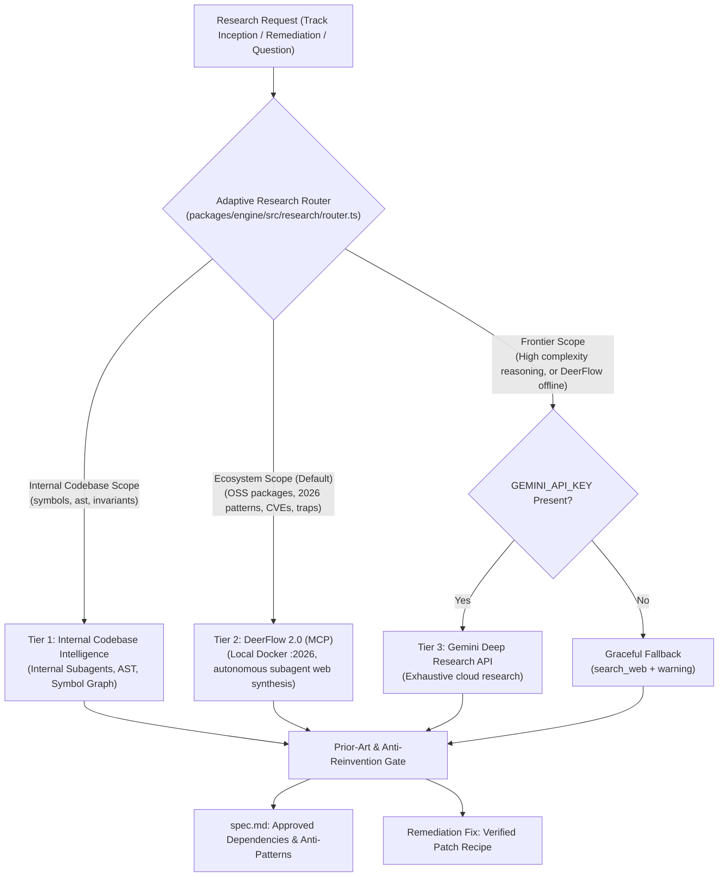

# Design Document: Adaptive Multi-Tier Research Router & DeerFlow MCP Integration

**Date:** 2026-09-07  
**Status:** Approved  
**Author:** Pair Programming Swarm (Antigravity & User)  
**Target Domain:** `packages/engine/src/research/`, `packages/superconductor-core/src/remediation/`, `skills/new-track/`

---

## 1. Executive Summary & Problem Statement

Modern AI coding agents frequently fall into the trap of "re-inventing the wheel" — hand-rolling custom regular expressions, parsers, cryptographic routines, state machines, and retry algorithms instead of leveraging established, battle-tested open-source libraries. Furthermore, when unexpected failures or test regressions occur, agents often resort to speculative, ungrounded trial-and-error edits instead of consulting deep community research.

This system design introduces the **Adaptive Multi-Tier Research Router** and integrates **DeerFlow 2.0 MCP** as a first-class engine within Superconductor. It establishes:
1. **Intent-Based Tiered Routing** across Internal Agents, local DeerFlow 2.0 (Docker MCP), and exhaustive Gemini Deep Research API (cloud).
2. **User Control Hierarchy** allowing fine-grained mode configuration, explicit CLI flags, and interactive escalation.
3. **Prior-Art & Anti-Reinvention Gate** that locks vetted ecosystem dependencies into specifications and flags redundant hand-rolled logic.
4. **Remediation Deep Research** enabling multi-turn diagnostic dialogues via `deerflow_chat` to resolve complex bugs and upstream breaking changes without guessing.
5. **Resilient Circuit Breaker & Credential-Aware Fallback** ensuring operations gracefully degrade from DeerFlow to Gemini Deep Research (if `GEMINI_API_KEY` exists) and search engines, preventing failures or blocking.

---

## 2. System Architecture



---

## 3. Detailed Component Specifications

### 3.1 Adaptive Research Router (`AdaptiveResearchRouter`)
- **Location:** `packages/engine/src/research/adaptive-research-router.ts`
- **Responsibilities:**
  - Classifies incoming queries by intent:
    - `INTERNAL`: Codebase file references, internal types, workspace invariants.
    - `ECOSYSTEM`: Library discovery, package comparison, API best practices, bug/CVE analysis.
    - `FRONTIER`: Multi-domain reasoning, exhaustive theoretical exploration.
  - Inspects user configuration (`superconductor/agent-config.md`) and CLI flags (`--research <auto|deerflow|gemini|internal>`, `--exhaustive`).
  - Checks environment capabilities: verifies `GEMINI_API_KEY` existence before attempting Gemini Deep Research.
  - Dispatches queries to the selected provider with automated circuit-breaker protection.

### 3.2 DeerFlow 2.0 Research Provider (`DeerflowResearchProvider`)
- **Location:** `packages/engine/src/research/providers/deerflow-research-provider.ts`
- **Implements:** `IResearchProvider` (`search(query: IResearchQuery): Promise<IResearchSource[]>`)
- **Protocol:**
  - Calls `deerflow_research` MCP tool (or HTTP POST to `http://127.0.0.1:2026/api/research`).
  - Supports execution modes: `pro` (default balanced thinking), `ultra` (parallel subagent decomposition), and `flash` (fast lookup).
  - Maintains `thread_id` sessions for multi-turn follow-ups.
  - Normalizes DeerFlow markdown responses into structured `IResearchSource` objects with extracted URLs, citations, code blocks, and key findings.

### 3.3 Prior-Art & Anti-Reinvention Gate
- **Location:** `packages/engine/src/research/anti-reinvention-gate.ts` & `skills/new-track/SKILL.md`
- **Inception Hook:**
  - Before `spec.md` is drafted, the router triggers DeerFlow to search package registries (npm, crates, PyPI).
  - Emits a structured `ResearchBrief`:
    - `OSS_DISCOVERY`: Top 2–3 battle-tested libraries (downloads, maintenance, license).
    - `ARCHITECTURAL_PATTERN`: Established RFCs or industry patterns.
    - `ANTI_PATTERNS`: Traps, known CVEs, and what NOT to hand-roll.
  - Injects `## Ecosystem Alignment & Prior Art (Anti-Reinvention)` directly into `spec.md` and `plan.md`.
- **Review Hook:**
  - In `superconductor-reviewer` (Correctness), check if the pull request or task implements custom logic duplicating an approved dependency. Flags `COR-REINVENT` if violated.

### 3.4 Remediation Deep Research & Multi-Turn Bug Resolution
- **Location:** `packages/superconductor-core/src/remediation/deep-research-escalation-handler.ts`
- **Workflow:**
  - Triggered when a task fails 2 consecutive TDD cycles or Quorum issues a `NEEDS_FIXES` finding.
  - Constructs diagnostic payload: exact terminal error trace, stack trace, failing Git diff, and affected files.
  - Invokes `deerflow_research` with `mode: 'pro'`.
  - Uses `deerflow_chat` on the returned `thread_id` to evaluate compatibility with existing `package.json` dependencies.
  - Emits a surgical fix recipe for the `RemediationProcessor` subagent.
  - Detects policy keywords (`breaking change`, `CVE`, `architectural`) to request user confirmation when needed.

### 3.5 Circuit Breaker & Fallback Chain
- **Failure Threshold:** 2 consecutive connection errors or timeouts (>60s) trips circuit breaker for 60 seconds.
- **Cascade:**
  1. Primary: **DeerFlow 2.0 MCP** (Local Docker).
  2. Fallback 1: **Gemini Deep Research API** (if `GEMINI_API_KEY` is present and valid).
  3. Fallback 2: **Standard Web Search (`search_web`)** with degraded mode warning.

---

## 4. User Configuration & Control

In `superconductor/agent-config.md`:

```markdown
## Research Provider Settings

- **Research Mode:** `auto` # auto | deerflow-preferred | gemini-preferred | internal-only
- **DeerFlow Mode:** `pro` # pro | ultra | flash
- **DeerFlow Endpoint:** `http://127.0.0.1:2026`
- **Gemini Deep Research:** enabled # requires GEMINI_API_KEY
- **Anti-Reinvention Gate:** active # enforces OSS discovery before spec generation
```

CLI flags:
- `superconductor new-track "description" [--research <auto|deerflow|gemini|internal>] [--exhaustive]`
- `superconductor implement [--research-fallback <deerflow|gemini>]`

---

## 5. Verification & Testing Strategy

1. **Unit Tests:**
   - `deerflow-research-provider.test.ts`: Mocked tool calls, source extraction, markdown parsing, and HTTP/MCP transport.
   - `adaptive-research-router.test.ts`: Intent classification heuristics, user override resolution, and credential validation (`GEMINI_API_KEY`).
   - `anti-reinvention-gate.test.ts`: Detection of custom reinvention anti-patterns and injection of locked dependencies.
2. **Circuit Breaker & Fallback Tests:**
   - Verify seamless transition from DeerFlow to Gemini API when DeerFlow errors.
   - Verify fallback to `search_web` when `GEMINI_API_KEY` is absent.
3. **End-to-End Integration Suite:**
   - `tests/e2e/adaptive-research-e2e.test.ts`: Exercise track inception $\to$ DeerFlow research $\to$ brief generation $\to$ dependency injection $\to$ TDD implementation.
