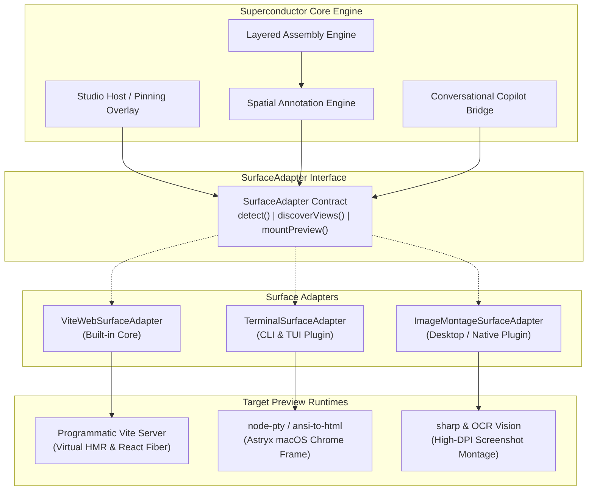
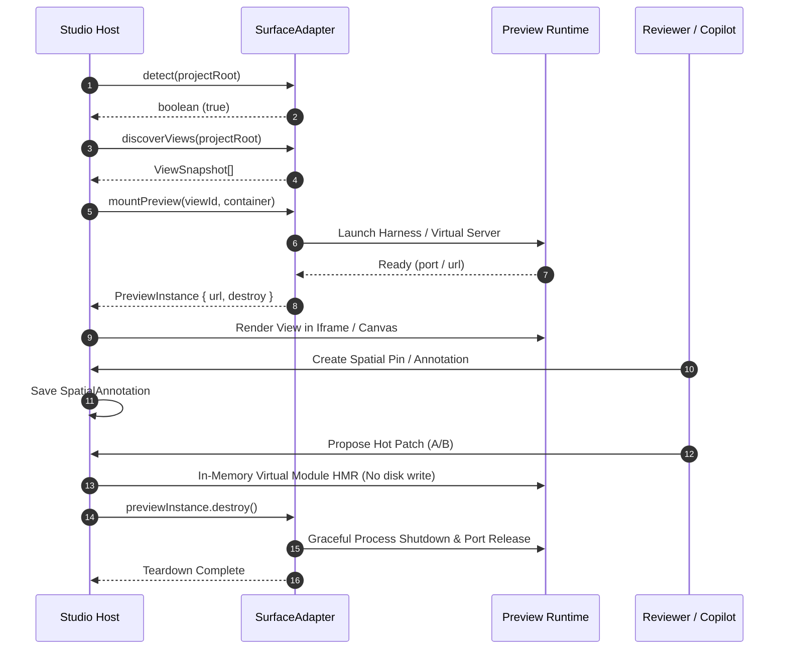
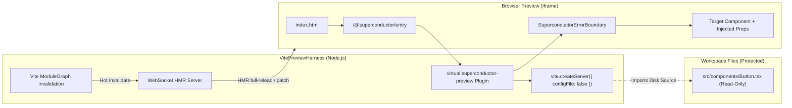
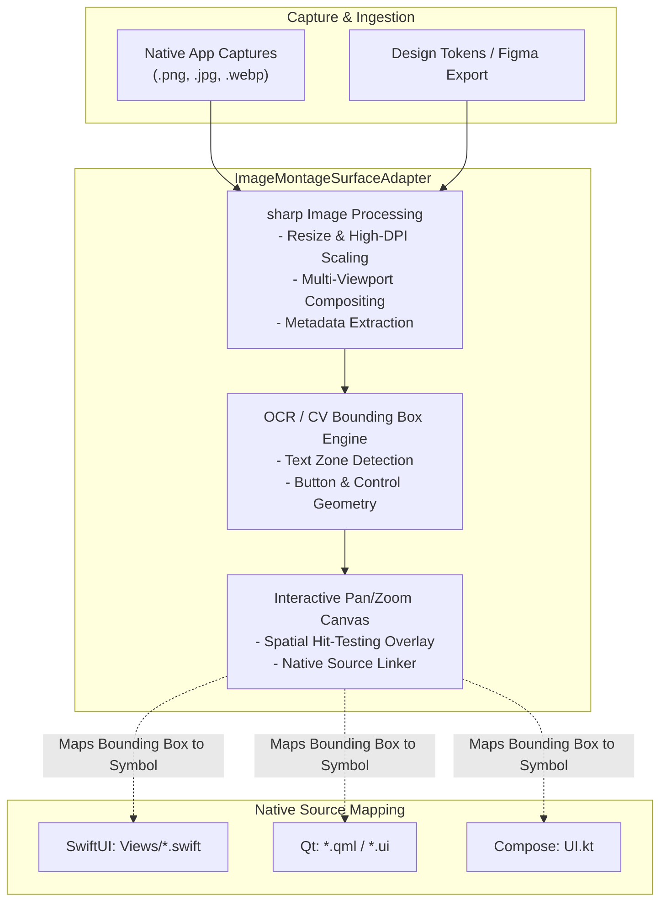
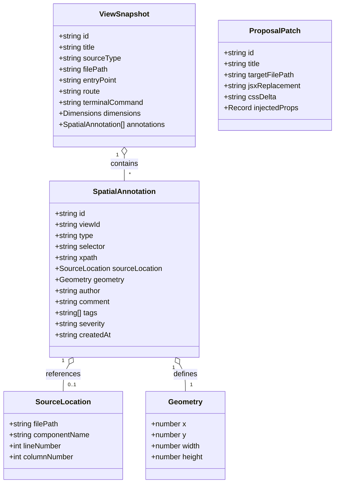

# SurfaceAdapter Architecture & Plugin Developer Guide

The **SurfaceAdapter** architecture is the extensibility foundation of the Superconductor Visual Studio and Living Wireframe system. Introduced in [ADR 0004: Web-First Core with Pluggable Surface Adapters](file:///home/gooseware/repos/gemini/extensions/superconductor/superconductor/adrs/0004-web-first-core-with-pluggable-surface-adapters.md), this design abstracts rendering contexts, preview lifecycles, and coordinate systems away from the core Superconductor engine.

By decoupling the rendering runtime from the studio host, Superconductor delivers:
- **Zero Binary Dependency Core**: The core engine remains ultra-lightweight and instantly installable without forcing native C++ compilation dependencies (`node-pty`, `sharp`, `libvips`) on projects that do not need them.
- **Universal Multi-Surface Extensibility**: While the core ships with a first-class `ViteWebSurfaceAdapter` for modern web frameworks, any team or plugin author can implement custom surface adapters for Terminal CLI tools, Native Desktop applications, Game engines, or static design mockups.
- **Unified Spatial Feedback & Assembly**: Regardless of whether a surface is an interactive DOM tree, a VT100 terminal grid, or a high-resolution native window screenshot, user annotations, spatial pins, and AI proposals map into the same unified `SpatialAnnotation` and `ViewSnapshot` data models.

---

## Architectural Overview

The Superconductor Studio interacts with all preview environments strictly through the `SurfaceAdapter` contract. The studio host never assumes the presence of a DOM or a browser window; instead, it delegates project detection, view discovery, preview mounting, and teardown to the active adapter.



---

## The SurfaceAdapter Interface Contract

Every adapter implements the `SurfaceAdapter` interface defined in [`@superconductor/core`](file:///home/gooseware/repos/gemini/extensions/superconductor/packages/superconductor-core/src/visual/surface-adapter.ts):

```typescript
export interface SurfaceAdapter {
  /**
   * Unique machine-readable identifier for the adapter
   * (e.g., 'vite_web', 'terminal_cli', 'image_montage').
   */
  readonly name: string;

  /**
   * Evaluates the project directory and determines whether this adapter
   * can handle the workspace.
   *
   * @param projectRoot Absolute path to the workspace root.
   * @returns Resolves true if compatible, false otherwise.
   */
  detect(projectRoot: string): Promise<boolean>;

  /**
   * Scans the workspace to identify viewable screens, UI components,
   * terminal commands, or captured window scenes.
   *
   * @param projectRoot Absolute path to the workspace root.
   * @returns Array of validated ViewSnapshot descriptors.
   */
  discoverViews(projectRoot: string): Promise<ViewSnapshot[]>;

  /**
   * Prepares and launches the preview harness for the given viewId,
   * returning an active PreviewInstance with connection metadata and teardown hooks.
   *
   * @param viewId The unique ID of the view to render.
   * @param container Optional DOM container when mounting directly inside the web studio.
   * @returns Active preview handle with URL and destroy() cleanup callback.
   */
  mountPreview(viewId: string, container?: HTMLElement): Promise<PreviewInstance>;
}
```

### Supporting Base Class

For convenience, plugin authors can extend `BaseSurfaceAdapter`, which provides standard type conformance:

```typescript
export abstract class BaseSurfaceAdapter implements SurfaceAdapter {
  abstract readonly name: string;
  abstract detect(projectRoot: string): Promise<boolean>;
  abstract discoverViews(projectRoot: string): Promise<ViewSnapshot[]>;
  abstract mountPreview(viewId: string, container?: HTMLElement): Promise<PreviewInstance>;
}
```

### Preview Lifecycle & Teardown

Preview instances return an active handle conforming to `PreviewInstance`:

```typescript
export interface PreviewInstance {
  viewId: string;
  url: string;
  destroy(): Promise<void>;
}
```

When switching views, closing the preview pane, or shutting down the Superconductor studio, the host calls `destroy()`. Adapters **must** guarantee idempotent cleanup:
1. Terminate spawned background processes, CLI child processes, or pseudoterminal handles (`node-pty`).
2. Close active HTTP/WebSocket servers and release bound network ports.
3. Clean up in-memory caches and temporary artifacts.



---

## Section 1: Built-in `ViteWebSurfaceAdapter`

The **`ViteWebSurfaceAdapter`** is the standard web adapter bundled with Superconductor core. It is optimized for React, Next.js, Vite, Vue, Svelte, and modern ESM-based Single Page Applications.

### Core Capabilities
1. **Sub-50ms Programmatic Server Harness**: Leverages `vite.createServer` in middleware mode with dynamic port allocation.
2. **In-Memory Virtual Module Injection**: Uses synthetic module specifiers (`/@superconductor/entry` and `\0virtual:superconductor-preview`) to preview isolated components without creating temporary scratch files on disk.
3. **React Fiber Introspection**: Queries `fiber._debugSource` and `fiber._debugOwner` from live DOM elements to extract the exact source file path, line number, and component name of any clicked element.
4. **Live In-DOM Proposal Patching & A/B Toggling**: Injects virtual JSX replacements, CSS deltas, and mock props via Vite's WebSocket HMR channel without modifying workspace source code.
5. **Superconductor ErrorBoundary**: Wraps previewed components in a resilient React error boundary that intercepts rendering exceptions, visualizes stack traces, and prevents studio crashes.

### Programmatic Vite Harness Architecture



### React Fiber Source Location Mapping

When a reviewer clicks an element in the web preview, the studio queries the React Fiber node attached to the DOM element (`__reactFiber$...`):

```typescript
export function resolveFiberSourceLocation(element: HTMLElement): {
  filePath: string;
  componentName?: string;
  lineNumber?: number;
  columnNumber?: number;
} | null {
  const fiberKey = Object.keys(element).find(
    (key) => key.startsWith('__reactFiber$') || key.startsWith('__reactInternalInstance$')
  );
  if (!fiberKey) return null;

  let fiber = (element as any)[fiberKey];
  while (fiber) {
    if (fiber._debugSource) {
      return {
        filePath: fiber._debugSource.fileName,
        componentName: fiber.type?.displayName || fiber.type?.name || 'Component',
        lineNumber: fiber._debugSource.lineNumber,
        columnNumber: fiber._debugSource.columnNumber,
      };
    }
    fiber = fiber.return;
  }
  return null;
}
```

This mapping guarantees that annotations created in the Visual Studio are directly linked to exact source code positions for downstream track synthesis.

---

## Section 2: Implementing `TerminalSurfaceAdapter` for CLI Tools

CLI applications, TUI tools, developer utilities, and backend REPLs do not render DOM elements. To provide living wireframes and spatial feedback for terminal workflows, developers can implement a **`TerminalSurfaceAdapter`**.

### Terminal Surface Requirements
1. **Pseudoterminal Spawning**: Spawns CLI commands in non-interactive or interactive PTY mode using `node-pty` or child process streams.
2. **ANSI to HTML Rendering**: Translates 16-color, 256-color, and 24-bit TrueColor ANSI escape sequences into styled HTML using `ansi-to-html` or renders full VT100 sessions via `@xterm/xterm`.
3. **Astryx macOS Chrome Frame**: Encloses the output in an authentic terminal window with macOS traffic lights (`#ff5f56`, `#ffbd2e`, `#27c93f`), active command badges, and JetBrains Mono / SF Mono typography.
4. **Grid-Based Hit Testing**: Translates mouse clicks on character rows and columns into line numbers, token boundaries, and command-line arguments.

### Complete Working Implementation

Below is a complete, production-ready `TerminalSurfaceAdapter` implementation:

```typescript
import { spawn, type ChildProcess } from 'node:child_process';
import * as fs from 'node:fs';
import * as path from 'node:path';
import * as http from 'node:http';
import AnsiToHtml from 'ansi-to-html';
import {
  BaseSurfaceAdapter,
  type ViewSnapshot,
  type PreviewInstance,
  validateViewSnapshot,
} from '@superconductor/core';

export interface TerminalViewConfig {
  id: string;
  title: string;
  command: string;
  args: string[];
  cwd?: string;
  env?: Record<string, string>;
  dimensions?: { width: number; height: number };
}

/**
 * TerminalSurfaceAdapter renders CLI commands and TUI interfaces inside an
 * authentic Astryx macOS terminal chrome frame with full ANSI TrueColor support.
 */
export class TerminalSurfaceAdapter extends BaseSurfaceAdapter {
  readonly name = 'terminal_cli';
  private projectRoot: string = '';
  private ansiConverter: AnsiToHtml;
  private configuredViews: Map<string, TerminalViewConfig> = new Map();
  private activeServers: Set<http.Server> = new Set();
  private activeProcesses: Set<ChildProcess> = new Set();

  constructor() {
    super();
    this.ansiConverter = new AnsiToHtml({
      fg: '#e4e4e7',
      bg: '#09090b',
      newline: true,
      escapeXML: true,
      colors: {
        0: '#18181b', // black
        1: '#ef4444', // red
        2: '#22c55e', // green
        3: '#eab308', // yellow
        4: '#3b82f6', // blue
        5: '#a855f7', // magenta
        6: '#06b6d4', // cyan
        7: '#f4f4f5', // white
      },
    });
  }

  /**
   * Detects whether the project has executable CLI binaries or CLI frameworks.
   */
  async detect(projectRoot: string): Promise<boolean> {
    this.projectRoot = projectRoot;
    const pkgPath = path.join(projectRoot, 'package.json');
    if (!fs.existsSync(pkgPath)) return false;

    try {
      const pkg = JSON.parse(fs.readFileSync(pkgPath, 'utf-8'));
      const hasBin = Boolean(pkg.bin);
      const hasCliDeps = Boolean(
        pkg.dependencies?.commander ||
        pkg.dependencies?.yargs ||
        pkg.dependencies?.cac ||
        pkg.dependencies?.meow ||
        pkg.devDependencies?.commander
      );
      return hasBin || hasCliDeps;
    } catch {
      return false;
    }
  }

  /**
   * Discovers CLI entry points and scripts from package.json.
   */
  async discoverViews(projectRoot: string): Promise<ViewSnapshot[]> {
    this.projectRoot = projectRoot;
    const snapshots: ViewSnapshot[] = [];
    const pkgPath = path.join(projectRoot, 'package.json');
    if (!fs.existsSync(pkgPath)) return [];

    try {
      const pkg = JSON.parse(fs.readFileSync(pkgPath, 'utf-8'));

      // Discover binaries
      if (pkg.bin) {
        if (typeof pkg.bin === 'string') {
          const viewId = `cli-${pkg.name || 'main'}`;
          this.configuredViews.set(viewId, {
            id: viewId,
            title: `${pkg.name || 'cli'} --help`,
            command: 'node',
            args: [pkg.bin, '--help'],
          });
          snapshots.push({
            id: viewId,
            title: `${pkg.name || 'cli'} CLI Preview`,
            sourceType: 'terminal_cli',
            filePath: pkg.bin,
            terminalCommand: `${pkg.name || 'cli'} --help`,
            dimensions: { width: 900, height: 500 },
          });
        } else if (typeof pkg.bin === 'object') {
          for (const [binName, binRelPath] of Object.entries(pkg.bin)) {
            const viewId = `cli-${binName}`;
            this.configuredViews.set(viewId, {
              id: viewId,
              title: `${binName} --help`,
              command: 'node',
              args: [binRelPath as string, '--help'],
            });
            snapshots.push({
              id: viewId,
              title: `${binName} CLI Preview`,
              sourceType: 'terminal_cli',
              filePath: binRelPath as string,
              terminalCommand: `${binName} --help`,
              dimensions: { width: 900, height: 500 },
            });
          }
        }
      }

      // Discover test/dev scripts
      if (pkg.scripts) {
        for (const [scriptName, scriptCmd] of Object.entries(pkg.scripts)) {
          if (scriptName.includes('help') || scriptName.includes('status') || scriptName === 'start') {
            const viewId = `script-${scriptName}`;
            this.configuredViews.set(viewId, {
              id: viewId,
              title: `npm run ${scriptName}`,
              command: 'npm',
              args: ['run', scriptName],
            });
            snapshots.push({
              id: viewId,
              title: `Script: npm run ${scriptName}`,
              sourceType: 'terminal_cli',
              filePath: 'package.json',
              terminalCommand: String(scriptCmd),
              dimensions: { width: 900, height: 500 },
            });
          }
        }
      }
    } catch (err) {
      console.error('[TerminalSurfaceAdapter] Error discovering CLI views:', err);
    }

    return snapshots.map((s) => validateViewSnapshot(s));
  }

  /**
   * Registers a custom CLI command dynamically.
   */
  registerCommandView(config: TerminalViewConfig, filePath = 'src/cli.ts'): ViewSnapshot {
    this.configuredViews.set(config.id, config);
    const snapshot: ViewSnapshot = {
      id: config.id,
      title: config.title,
      sourceType: 'terminal_cli',
      filePath,
      terminalCommand: `${config.command} ${config.args.join(' ')}`,
      dimensions: config.dimensions || { width: 900, height: 520 },
    };
    return validateViewSnapshot(snapshot);
  }

  /**
   * Mounts the preview by executing the command, capturing ANSI output,
   * wrapping it in an Astryx macOS terminal frame, and hosting it on a local HTTP server.
   */
  async mountPreview(viewId: string, _container?: HTMLElement): Promise<PreviewInstance> {
    const config = this.configuredViews.get(viewId);
    if (!config) {
      throw new Error(`View '${viewId}' is not registered in TerminalSurfaceAdapter`);
    }

    // Execute command and collect buffered ANSI stream
    const rawAnsi = await this.captureCommandOutput(config);
    const formattedHtml = this.ansiConverter.toHtml(rawAnsi);
    const pageHtml = this.renderAstryxTerminalFrame(config, formattedHtml);

    // Host output via ephemeral server
    const server = http.createServer((req, res) => {
      res.writeHead(200, {
        'Content-Type': 'text/html; charset=utf-8',
        'X-Content-Type-Options': 'nosniff',
      });
      res.end(pageHtml);
    });

    this.activeServers.add(server);

    const port = await new Promise<number>((resolve, reject) => {
      server.listen(0, '127.0.0.1', () => {
        const addr = server.address();
        if (typeof addr === 'object' && addr !== null) {
          resolve(addr.port);
        } else {
          reject(new Error('Failed to obtain server address'));
        }
      });
      server.on('error', reject);
    });

    const url = `http://127.0.0.1:${port}`;

    return {
      viewId,
      url,
      destroy: async () => {
        this.activeServers.delete(server);
        await new Promise<void>((resolve) => server.close(() => resolve()));
      },
    };
  }

  /**
   * Safely spawns the command process with timeout and output truncation guards.
   */
  private captureCommandOutput(config: TerminalViewConfig): Promise<string> {
    return new Promise((resolve) => {
      let output = '';
      const workingDir = config.cwd || this.projectRoot || process.cwd();
      const child = spawn(config.command, config.args, {
        cwd: workingDir,
        env: {
          ...process.env,
          ...config.env,
          FORCE_COLOR: '1',
          TERM: 'xterm-256color',
        },
        shell: false, // Prevents shell injection
      });

      this.activeProcesses.add(child);

      const timeout = setTimeout(() => {
        child.kill('SIGKILL');
        output += '\n\x1b[33m[Superconductor] Command timed out after 10000ms.\x1b[0m';
      }, 10000);

      child.stdout?.on('data', (data) => {
        output += data.toString();
        if (output.length > 500000) {
          child.kill('SIGTERM');
          output += '\n\x1b[33m[Superconductor] Output truncated at 500KB.\x1b[0m';
        }
      });

      child.stderr?.on('data', (data) => {
        output += data.toString();
      });

      child.on('error', (err) => {
        output += `\n\x1b[31m[Superconductor] Failed to spawn process: ${err.message}\x1b[0m`;
      });

      child.on('close', (code) => {
        clearTimeout(timeout);
        this.activeProcesses.delete(child);
        if (code !== 0 && code !== null) {
          output += `\n\x1b[90mProcess exited with code ${code}\x1b[0m`;
        }
        resolve(output || '\x1b[90m(No output emitted)\x1b[0m');
      });
    });
  }

  /**
   * Generates the Astryx macOS window chrome HTML.
   */
  private renderAstryxTerminalFrame(config: TerminalViewConfig, htmlBody: string): string {
    const fullCommand = `${config.command} ${config.args.join(' ')}`;
    return `<!DOCTYPE html>
<html lang="en">
<head>
  <meta charset="UTF-8">
  <meta name="viewport" content="width=device-width, initial-scale=1.0">
  <title>${config.title} - Terminal Preview</title>
  <style>
    * { box-sizing: border-box; margin: 0; padding: 0; }
    body {
      background-color: #09090b;
      color: #f4f4f5;
      font-family: -apple-system, BlinkMacSystemFont, "Segoe UI", Roboto, sans-serif;
      min-height: 100vh;
      display: flex;
      align-items: center;
      justify-content: center;
      padding: 24px;
    }
    .astryx-terminal-frame {
      width: 100%;
      max-width: 960px;
      background-color: #121215;
      border: 1px solid #27272a;
      border-radius: 10px;
      box-shadow: 0 20px 40px rgba(0,0,0,0.6), 0 1px 3px rgba(0,0,0,0.4);
      overflow: hidden;
      display: flex;
      flex-direction: column;
    }
    .astryx-titlebar {
      height: 38px;
      background: linear-gradient(180deg, #222227 0%, #1a1a1f 100%);
      border-bottom: 1px solid #27272a;
      display: flex;
      align-items: center;
      padding: 0 14px;
      position: relative;
      user-select: none;
    }
    .traffic-lights {
      display: flex;
      gap: 8px;
      z-index: 2;
    }
    .traffic-dot {
      width: 12px;
      height: 12px;
      border-radius: 50%;
    }
    .traffic-close { background-color: #ff5f56; border: 1px solid #e0443e; }
    .traffic-min { background-color: #ffbd2e; border: 1px solid #dea123; }
    .traffic-max { background-color: #27c93f; border: 1px solid #1aab29; }
    .titlebar-center {
      position: absolute;
      left: 0;
      right: 0;
      text-align: center;
      font-size: 13px;
      font-weight: 500;
      color: #a1a1aa;
      pointer-events: none;
      display: flex;
      align-items: center;
      justify-content: center;
      gap: 6px;
    }
    .command-badge {
      background-color: #27272a;
      color: #38bdf8;
      font-family: ui-monospace, SFMono-Regular, Menlo, Monaco, Consolas, monospace;
      font-size: 11px;
      padding: 2px 8px;
      border-radius: 4px;
    }
    .terminal-body {
      padding: 16px 20px;
      font-family: "JetBrains Mono", ui-monospace, SFMono-Regular, Menlo, monospace;
      font-size: 13px;
      line-height: 1.6;
      background-color: #09090b;
      color: #e4e4e7;
      overflow-x: auto;
      max-height: 70vh;
      white-space: pre-wrap;
      word-break: break-all;
    }
  </style>
</head>
<body>
  <div class="astryx-terminal-frame" data-view-id="${config.id}">
    <div class="astryx-titlebar">
      <div class="traffic-lights">
        <div class="traffic-dot traffic-close"></div>
        <div class="traffic-dot traffic-min"></div>
        <div class="traffic-dot traffic-max"></div>
      </div>
      <div class="titlebar-center">
        <span>Terminal</span>
        <span class="command-badge">${fullCommand}</span>
      </div>
    </div>
    <div class="terminal-body" data-testid="terminal-output">${htmlBody}</div>
  </div>
</body>
</html>`;
  }
}
```

---

## Section 3: Implementing `ImageMontageSurfaceAdapter` for Native/Desktop Apps

Native desktop applications (SwiftUI, AppKit, WPF/WinUI, Qt/QML, Jetpack Compose Desktop, Flutter Desktop) cannot be directly embedded into an in-browser iframe via web DOM.

To support native workflows, the **`ImageMontageSurfaceAdapter`** ingests high-resolution UI screen captures or design artifacts, composites them into an interactive multi-screen montage canvas using [`sharp`](https://sharp.pixelplumbing.com/), and maps OCR bounding boxes to native code structures.

### Image Montage Architecture



### Complete Working Implementation

```typescript
import * as fs from 'node:fs';
import * as path from 'node:path';
import * as http from 'node:http';
import {
  BaseSurfaceAdapter,
  type ViewSnapshot,
  type PreviewInstance,
  type SpatialAnnotation,
  validateViewSnapshot,
} from '@superconductor/core';

export interface ImageSceneConfig {
  id: string;
  title: string;
  sourceImagePath: string;
  targetSourceFile: string;
  dimensions?: { width: number; height: number };
  detectedRegions?: Array<{
    id: string;
    label: string;
    x: number;
    y: number;
    width: number;
    height: number;
  }>;
}

/**
 * ImageMontageSurfaceAdapter enables living wireframes and spatial feedback
 * for Native Desktop, Mobile, and Embedded UIs using screenshot captures
 * and high-resolution compositing.
 */
export class ImageMontageSurfaceAdapter extends BaseSurfaceAdapter {
  readonly name = 'image_montage';
  private projectRoot: string = '';
  private scenes: Map<string, ImageSceneConfig> = new Map();
  private activeServers: Set<http.Server> = new Set();

  constructor() {
    super();
  }

  /**
   * Detects native desktop/mobile projects by scanning for platform manifests.
   */
  async detect(projectRoot: string): Promise<boolean> {
    this.projectRoot = projectRoot;
    const markers = [
      'Package.swift',          // macOS / iOS (SwiftUI)
      'pubspec.yaml',           // Flutter
      'build.gradle.kts',       // Android / Compose Desktop
      'build.gradle',           // Android
      'CMakeLists.txt',         // C++ / Qt
      'Cargo.toml',             // Rust / Slint / Tauri
    ];

    for (const marker of markers) {
      if (fs.existsSync(path.join(projectRoot, marker))) {
        return true;
      }
    }

    // Also detect if a dedicated screenshot captures folder exists
    const capturesDir = path.join(projectRoot, '.superconductor', 'captures');
    return fs.existsSync(capturesDir);
  }

  /**
   * Discovers visual captures within the project workspace.
   */
  async discoverViews(projectRoot: string): Promise<ViewSnapshot[]> {
    this.projectRoot = projectRoot;
    const snapshots: ViewSnapshot[] = [];
    const searchDirs = [
      path.join(projectRoot, '.superconductor', 'captures'),
      path.join(projectRoot, 'design', 'wireframes'),
      path.join(projectRoot, 'screenshots'),
    ];

    for (const dir of searchDirs) {
      if (!fs.existsSync(dir)) continue;
      const files = fs.readdirSync(dir);
      for (const file of files) {
        const ext = path.extname(file).toLowerCase();
        if (['.png', '.jpg', '.jpeg', '.webp'].includes(ext)) {
          const baseName = path.basename(file, ext);
          const viewId = `scene-${baseName}`;
          const fullPath = path.join(dir, file);

          const sceneConfig: ImageSceneConfig = {
            id: viewId,
            title: `Scene: ${baseName}`,
            sourceImagePath: fullPath,
            targetSourceFile: this.inferNativeSourceFile(baseName),
            dimensions: { width: 1440, height: 900 },
          };
          this.scenes.set(viewId, sceneConfig);

          snapshots.push({
            id: viewId,
            title: `Native Scene: ${baseName}`,
            sourceType: 'static_image',
            filePath: sceneConfig.targetSourceFile,
            dimensions: sceneConfig.dimensions,
          });
        }
      }
    }

    return snapshots.map((s) => validateViewSnapshot(s));
  }

  /**
   * Manually registers a screenshot scene with bounding box metadata.
   */
  registerScene(scene: ImageSceneConfig): ViewSnapshot {
    this.scenes.set(scene.id, scene);
    const snapshot: ViewSnapshot = {
      id: scene.id,
      title: scene.title,
      sourceType: 'static_image',
      filePath: scene.targetSourceFile,
      dimensions: scene.dimensions || { width: 1440, height: 900 },
    };
    return validateViewSnapshot(snapshot);
  }

  /**
   * Mounts the image preview inside an interactive canvas viewer with pan/zoom
   * and bounding-box hit testing.
   */
  async mountPreview(viewId: string, _container?: HTMLElement): Promise<PreviewInstance> {
    const scene = this.scenes.get(viewId);
    if (!scene) {
      throw new Error(`Scene '${viewId}' is not registered in ImageMontageSurfaceAdapter`);
    }

    // Read image data as Base64 for zero-dependency embedding
    const imageBuffer = fs.readFileSync(scene.sourceImagePath);
    const mimeType = scene.sourceImagePath.endsWith('.png') ? 'image/png' : 'image/jpeg';
    const base64Data = `data:${mimeType};base64,${imageBuffer.toString('base64')}`;

    const viewerHtml = this.renderImageViewerHtml(scene, base64Data);

    const server = http.createServer((req, res) => {
      res.writeHead(200, {
        'Content-Type': 'text/html; charset=utf-8',
        'X-Content-Type-Options': 'nosniff',
      });
      res.end(viewerHtml);
    });

    this.activeServers.add(server);

    const port = await new Promise<number>((resolve, reject) => {
      server.listen(0, '127.0.0.1', () => {
        const addr = server.address();
        if (typeof addr === 'object' && addr !== null) {
          resolve(addr.port);
        } else {
          reject(new Error('Failed to bind server port'));
        }
      });
      server.on('error', reject);
    });

    const url = `http://127.0.0.1:${port}`;

    return {
      viewId,
      url,
      destroy: async () => {
        this.activeServers.delete(server);
        await new Promise<void>((resolve) => server.close(() => resolve()));
      },
    };
  }

  /**
   * Heuristically associates screenshot names with native source files.
   */
  private inferNativeSourceFile(name: string): string {
    const clean = name.replace(/[-_]/g, '').toLowerCase();
    const candidateFiles = [
      `Sources/Views/${name}.swift`,
      `lib/views/${name}.dart`,
      `ui/${name}.qml`,
      `src/ui/${name}.rs`,
    ];
    for (const candidate of candidateFiles) {
      if (fs.existsSync(path.join(this.projectRoot, candidate))) {
        return candidate;
      }
    }
    return `Sources/Views/${name}.swift`; // Default fallback
  }

  /**
   * Generates interactive pan/zoom canvas HTML with spatial bounding box overlays.
   */
  private renderImageViewerHtml(scene: ImageSceneConfig, base64Image: string): string {
    const regionsJson = JSON.stringify(scene.detectedRegions || []);

    return `<!DOCTYPE html>
<html lang="en">
<head>
  <meta charset="UTF-8">
  <meta name="viewport" content="width=device-width, initial-scale=1.0">
  <title>${scene.title}</title>
  <style>
    * { box-sizing: border-box; margin: 0; padding: 0; }
    body {
      background-color: #09090b;
      color: #f4f4f5;
      font-family: system-ui, sans-serif;
      overflow: hidden;
      height: 100vh;
      display: flex;
      flex-direction: column;
    }
    .hud-bar {
      height: 44px;
      background-color: #18181b;
      border-bottom: 1px solid #27272a;
      display: flex;
      align-items: center;
      justify-content: space-between;
      padding: 0 16px;
      font-size: 13px;
      z-index: 10;
    }
    .hud-title { font-weight: 600; color: #e4e4e7; }
    .hud-meta { color: #a1a1aa; font-family: monospace; font-size: 11px; }
    .canvas-viewport {
      flex: 1;
      position: relative;
      overflow: auto;
      display: flex;
      align-items: center;
      justify-content: center;
      background-image: radial-gradient(#27272a 1px, transparent 1px);
      background-size: 20px 20px;
    }
    .stage-container {
      position: relative;
      box-shadow: 0 25px 50px -12px rgba(0,0,0,0.7);
      border-radius: 8px;
      overflow: hidden;
    }
    .stage-image {
      display: block;
      max-width: 90vw;
      max-height: 85vh;
      user-select: none;
      pointer-events: none;
    }
    /* Hit-Testing Dogma overlay */
    .annotation-overlay {
      position: absolute;
      top: 0;
      left: 0;
      width: 100%;
      height: 100%;
      pointer-events: none; /* PASS-THROUGH */
    }
    .bounding-box {
      position: absolute;
      border: 2px dashed #38bdf8;
      background-color: rgba(56, 189, 248, 0.1);
      pointer-events: auto; /* INTERACTIVE */
      cursor: pointer;
      transition: background-color 0.15s ease;
    }
    .bounding-box:hover {
      background-color: rgba(56, 189, 248, 0.25);
      border-color: #7dd3fc;
    }
    .box-label {
      position: absolute;
      top: -20px;
      left: 0;
      background-color: #0284c7;
      color: #ffffff;
      font-size: 10px;
      padding: 2px 6px;
      border-radius: 3px;
      font-family: monospace;
      white-space: nowrap;
    }
  </style>
</head>
<body>
  <div class="hud-bar">
    <span class="hud-title">${scene.title}</span>
    <span class="hud-meta">Target: ${scene.targetSourceFile}</span>
  </div>
  <div class="canvas-viewport">
    <div class="stage-container" id="stage">
      
      <div class="annotation-overlay" id="overlay"></div>
    </div>
  </div>
  <script>
    const regions = ${regionsJson};
    const overlay = document.getElementById('overlay');
    regions.forEach(reg => {
      const box = document.createElement('div');
      box.className = 'bounding-box';
      box.style.left = reg.x + 'px';
      box.style.top = reg.y + 'px';
      box.style.width = reg.width + 'px';
      box.style.height = reg.height + 'px';
      const label = document.createElement('span');
      label.className = 'box-label';
      label.textContent = reg.label;
      box.appendChild(label);
      overlay.appendChild(box);
    });
  </script>
</body>
</html>`;
  }
}
```

---

## Section 4: Security, Hit-Testing Dogma & Spatial Annotation Data Model

### Universal UI Layer Hit-Testing Dogma

Superconductor enforces the **UI Layer Hit-Testing Dogma** codified in [`skills/design-heuristics/SKILL.md`](file:///home/gooseware/repos/gemini/extensions/superconductor/skills/design-heuristics/SKILL.md):

> **Dogma Rule 26**: Interactive subcomponents placed inside pass-through overlay containers, floating viewports, HUDs, or fixed headers/footers MUST explicitly configure event hit-testing to prevent pointer/touch event swallowing.

#### Cross-Platform Hit-Testing Rules

| Platform / Runtime | Container Configuration (Pass-Through) | Interactive Control Configuration (Clickable) |
| :--- | :--- | :--- |
| **Web / CSS** | `pointer-events: none;` | `pointer-events: auto;` |
| **Flutter** | `IgnorePointer(ignoring: true)` | `HitTestBehavior.opaque` or `IgnorePointer(ignoring: false)` |
| **SwiftUI** | `.allowsHitTesting(false)` | `.allowsHitTesting(true)` and `.contentShape(Rectangle())` |
| **Jetpack Compose** | Transparent Box without pointerInput | `Modifier.pointerInput(...)` or `Modifier.clickable(...)` |
| **Qt / QML** | `MouseArea { enabled: false }` | `MouseArea { enabled: true; acceptedMouseButtons: Qt.AllButtons }` |
| **Godot** | `mouse_filter = Control.MOUSE_FILTER_IGNORE` | `mouse_filter = Control.MOUSE_FILTER_STOP` |

#### Automated Interaction Verification
All surface adapters and UI test harnesses must include interaction verification tests ensuring that clicking an overlay pin or bounding box updates the pin selection state and **does not** swallow clicks intended for the underlying application canvas, or vice-versa.

---

### Spatial Annotation Data Model

The spatial annotation model is strictly validated via Zod schemas in `@superconductor/core`:



#### Multi-Layer Anchoring Strategy
Annotations use a 4-tier resilient anchoring strategy to survive refactorings and layout shifts:
1. **React Fiber Source Location**: Direct link to `filePath:lineNumber`. If the element moves, the source location remains precise.
2. **CSS Selector Path**: Unique deterministic CSS path (e.g., `#root > main > button.btn-primary`).
3. **XPath Expression**: Resilient structural traversal (`//button[contains(@class, 'btn-primary')]`).
4. **Viewport Normalized Coordinates**: Relative `(x, y)` percentages `[0.0, 1.0]` for zoom/pan resilience on responsive canvases.

#### Severity Ratings & Review Triage
Annotations declare an optional `severity` field for downstream triage:
- `blocker`: Critical accessibility failure (e.g., WCAG AA contrast violation), visual breakage, or crash.
- `enhancement`: Visual design polish, typography tuning, or spacing adjustment.
- `refactor`: Structural component clean-up, token extraction, or dead CSS removal.
- `nitpick`: Minor aesthetic suggestion or copy tweak.

---

### Security & Confinement Guarantees

Surface adapters execute code and host servers on the developer's machine. All adapters must adhere to three mandatory security guardrails:

#### 1. In-Memory Virtual Module Sandboxing (No Disk Pollution)
Surface adapters must **never** mutate source files on disk to show a preview or live proposal.
- Virtual modules must be served purely in-memory via dev server plugins or memory buffers.
- Proposal drafts remain ephemeral until the user explicitly commits the proposal to a track plan.

#### 2. Safe Command Execution in CLI Adapters
`TerminalSurfaceAdapter` instances must:
- Pass arguments as arrays (`spawn(command, args, { shell: false })`) to eliminate shell injection vulnerabilities.
- Enforce strict process timeouts (default: 10,000ms) to prevent runaway infinite loops or dangling zombie processes.
- Cap output buffers (default: 500KB) to prevent heap exhaustion.
- Isolate spawned process environments, stripping sensitive authentication tokens from leaked terminal output.

#### 3. Iframe Sandbox & Origin Isolation
When preview instances are embedded within the Superconductor Visual Studio, the host wraps the iframe in restrictive security flags:
```html
<iframe
  src="http://127.0.0.1:5173/@superconductor/entry"
  sandbox="allow-scripts allow-same-origin"
  referrerpolicy="no-referrer"
></iframe>
```
This isolates the preview runtime from the parent studio's token storage and agent IPC channels while preserving standard web component interactivity and HMR WebSocket connections.

---

## Adapter Authoring Checklist

When authoring a custom `SurfaceAdapter` plugin:
- [ ] Conforms to `SurfaceAdapter` or extends `BaseSurfaceAdapter`.
- [ ] Implements idempotent `detect(projectRoot)` with graceful fallback on missing files.
- [ ] Validates all discovered views via `validateViewSnapshot()`.
- [ ] Returns a robust `PreviewInstance` whose `destroy()` method cleanly terminates child processes and closes servers.
- [ ] Adheres to the **Universal UI Layer Hit-Testing Dogma** (`pointer-events: none` on container, `pointer-events: auto` on controls).
- [ ] Avoids permanent disk file pollution for ephemeral previews and hot proposals.
- [ ] Sanitizes all process execution parameters and avoids shell string interpolation.
