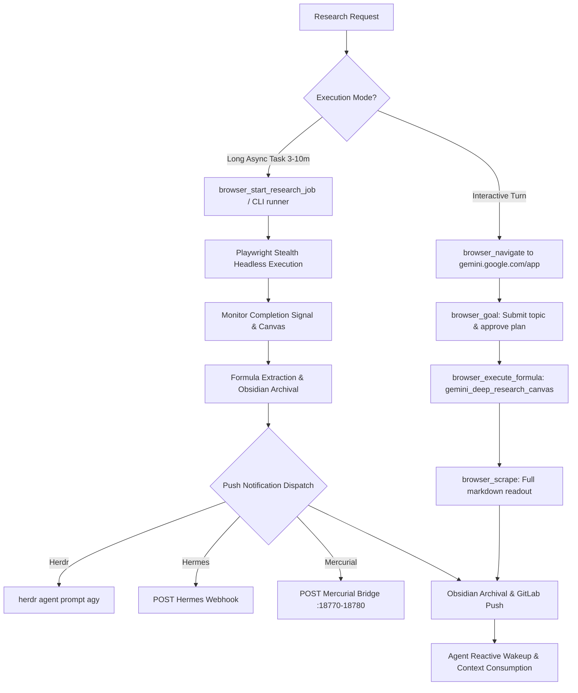

# Gemini Deep Research Skill

Autonomous in-depth web research engine leveraging Google Gemini Deep Research, stealth browser automation via `@superconductor/browser`, pre-compiled golden formulas, universal multi-channel push notifications, and automatic Obsidian Second Brain vault archival.

---

## Overview

Gemini Deep Research conducts autonomous multi-stage web investigation (browsing dozens of sources, synthesizing findings, and authoring exhaustive multi-thousand-word Canvas reports). Because Deep Research tasks take **3–10 minutes** to complete, this skill provides two distinct operational paths:

1. **Interactive Path (Synchronous / Supervised)**: Uses `superconductor-browser` MCP primitives (`browser_navigate`, `browser_goal`, `browser_execute_formula`, `browser_scrape`) when the agent or operator actively observes and approves intermediate steps.
2. **Background Async Path (Unattended / Long-Running)**: Dispatches headless background jobs via CLI (`pnpm superconductor-browser research`) or MCP (`browser_start_research_job`). Upon completion, the engine dispatches universal push notifications (Herdr agent prompt, Hermes webhook, or Mercurial bridge) to wake the agent without blocking the conversational turn.

Both paths extract structured findings using the golden formula `gemini_deep_research_canvas`, archive the resulting markdown report and citations to your Obsidian Second Brain (`gemini-obsidian/Research/`), and push changes to GitLab.



---

## When to Use

- **Exhaustive Technical & Architecture Research**: Evaluating libraries, hardware BOMs, distributed systems protocols, or complex architectural tradeoffs before authoring specs or implementation plans.
- **Deep Market & Domain Synthesis**: Gathering competitive analysis, academic literature reviews, or cross-disciplinary investigations requiring dozens of authoritative citations.
- **Unattended Long-Running Tasks (3–10 minutes)**: Handing off multi-stage research without tying up the agent's turn or burning LLM tokens on polling loops.
- **Permanent Knowledge Archival**: Persisting exhaustive technical briefings into the Obsidian Second Brain (`gemini-obsidian`) with automatic Git version control and bidirectional linking.

### When NOT to Use
- **Simple Fact Lookups**: For quick definitions or single-fact queries, use `search_web` or `browser_scrape` instead.
- **Google Search AI Overviews**: For conversational search queries and follow-up chains on `udm=50`, use `google-ai-mode` with `google_ai_search_overview`.
- **Legacy Raw CDP Scripts**: **NEVER** launch legacy Python CDP scripts (`run_deep_research.py`) or connect to raw Chrome debugging port `9222`. All automation runs through `superconductor-browser`.

---

## Core Architecture

### 1. Golden Formula: `gemini_deep_research_canvas`

Stored in `.superconductor/formulas/gemini_deep_research_canvas.json`:
- **Domain**: `gemini.google.com`
- **Target URL Pattern**: `https?://gemini\.google\.com/app.*`
- **Fields Extracted**:
  - `title`: Canvas title (`h1, .canvas-title, div[role='heading']`) [required]
  - `content`: Complete markdown research text (`.canvas-content, .markdown-body, article`) [required]
  - `citations`: External source URLs and attribution links (`a[data-citation], a.citation, .source-citation a`)
  - `thinking_steps`: Reasoning trace and intermediate research queries (`.thinking-steps, .research-thought`)
  - `outline`: Section table of contents (`.research-outline, .toc-item`)
- **Execution Speed**: 10–50ms native extraction; zero LLM token cost.
- **Self-Healing**: If Google updates class names, `FormulaHealer` flags drift and diagnoses candidate selectors automatically.

### 2. Universal Push Notification Subsystem

Long-running jobs notify subscribers via `PushNotificationDispatcher`:
- **Herdr Agent Prompt**: Calls `herdr agent prompt <agent> "Deep Research completed for '<topic>'. Report saved to <path>."` to inject a message directly into the target agent pane (default: `agy`).
- **Hermes Webhook**: Sends an HTTP `POST` to configured `HERMES_WEBHOOK_URL` with HMAC-SHA256 signature and JSON payload (`{ event: "research_complete", jobId, topic, filePath, summary, sources }`).
- **Mercurial Bridge**: Probes local ports `18770–18780` and posts the event to `http://127.0.0.1:<port>/events`.
- **Process Exit Code**: Emits standard zero exit code to trigger native background task completion wakeups.

### 3. Obsidian Second Brain Archival & GitLab Push

Every completed research report is persisted to the permanent knowledge base:
- **Location**: `/home/gooseware/repos/gemini/gemini-obsidian/Research/YYYY-MM-DD - <Topic>.md`
- **Frontmatter**: Standard Obsidian YAML including `date`, `topic`, `type: deep-research`, `tags`, and `citations`.
- **Git Push**: Commits and pushes the new note to GitLab (`git@gitlab.com:goosewares/gemini-obsidian`).

---

## Interactive Path (MCP Tools)

Use this workflow when conducting research step-by-step or monitoring live progress:

### Step 1: Navigate to Gemini with Stealth

Acquire or navigate an authenticated browser session:

```json
{
  "tool": "browser_navigate",
  "arguments": {
    "url": "https://gemini.google.com/app",
    "stealth": true
  }
}
```

### Step 2: Goal Submission & Plan Approval

Direct the browser agent to select Deep Research mode, enter the research brief, and approve the multi-stage research plan:

```json
{
  "tool": "browser_goal",
  "arguments": {
    "goal": "Click the model selector and choose Gemini Deep Research / Ultra. In the prompt input box, enter the research topic: 'State of the art magnetohydrodynamic hybrid reactors and phased array arc stabilization'. Press submit. When the research plan appears, click 'Start research' to approve the plan. Wait until research is marked complete or the Canvas document appears."
  }
}
```

### Step 3: Execute Golden Formula

Once the Canvas workspace is visible, deterministically extract the structured report:

```json
{
  "tool": "browser_execute_formula",
  "arguments": {
    "formulaId": "gemini_deep_research_canvas"
  }
}
```

**Sample Output:**
```json
{
  "success": true,
  "executionTimeMs": 32,
  "data": {
    "title": "Magnetohydrodynamic Hybrid Reactors: Phased Array Arc Stabilization",
    "content": "# Executive Summary\n\nRecent developments in closed-loop magnetohydrodynamic (MHD)...",
    "citations": [
      "https://arxiv.org/abs/2501.09876",
      "https://journals.aps.org/prl/abstract/10.1103/PhysRevLett.132.045001"
    ],
    "thinking_steps": "1. Analyzed MHD nonequilibrium plasma models\n2. Surveyed 14 papers on arc stability...",
    "outline": "1. Overview\n2. Electrode Erosion Dynamics\n3. High-Frequency RF Arc Inversion"
  },
  "driftDetected": false
}
```

### Step 4: Full Markdown Canvas Readout (Optional Fallback)

If raw DOM-to-markdown reading is preferred:

```json
{
  "tool": "browser_scrape",
  "arguments": {
    "url": "https://gemini.google.com/app",
    "mode": "read",
    "selector": ".canvas-content"
  }
}
```

---

## Background Async Path (Long-Running Jobs)

For deep research runs (typically 3–10 minutes), avoid blocking conversational turns by launching the job in the background.

### Option A: Via Command Line Interface (CLI)

Run `superconductor-browser research` from terminal or background command:

```bash
pnpm --filter @superconductor/browser superconductor-browser research \
  --topic "State of the art magnetohydrodynamic hybrid reactors and phased array arc stabilization" \
  --herdr-agent agy \
  --vault-dir /home/gooseware/repos/gemini/gemini-obsidian \
  --timeout 900
```

#### CLI Options
| Flag | Description | Default |
| :--- | :--- | :--- |
| `--topic`, `-t` | Natural language research topic or technical brief (Required) | — |
| `--herdr-agent` | Target Herdr agent pane to notify upon completion | `agy` |
| `--webhook-url` | Hermes or external webhook HTTP POST endpoint | `process.env.HERMES_WEBHOOK_URL` |
| `--webhook-secret` | Optional HMAC-SHA256 signing secret for webhook payload | `process.env.HERMES_WEBHOOK_SECRET` |
| `--vault-dir` | Target Obsidian vault root directory | `/home/gooseware/repos/gemini/gemini-obsidian` |
| `--no-push` | Skip pushing to GitLab remote (offline mode) | `false` |
| `--timeout` | Maximum execution timeout in seconds | `600` (10 minutes) |

### Option B: Via MCP Tool

Trigger the asynchronous runner through the MCP server:

```json
{
  "tool": "browser_start_research_job",
  "arguments": {
    "topic": "Zero-knowledge proof acceleration on RISC-V with custom vector extensions",
    "herdrAgent": "agy",
    "vaultDir": "/home/gooseware/repos/gemini/gemini-obsidian",
    "timeoutMs": 600000
  }
}
```

**Immediate Response:**
```json
{
  "jobId": "job-deep-res-1727913600",
  "status": "running",
  "topic": "Zero-knowledge proof acceleration on RISC-V with custom vector extensions",
  "message": "Deep Research initiated in background. You will receive a push notification when completed."
}
```

The agent stops calling tools and yields. When the job finishes, the push dispatcher sends the prompt or webhook, and the agent wakes reactively with the report already saved on disk.

---

## Obsidian Second Brain Archival Protocol

Every completed research artifact is written to the Obsidian vault following standard conventions:

### File Format
- **Path**: `/home/gooseware/repos/gemini/gemini-obsidian/Research/YYYY-MM-DD - <Sanitized Topic>.md`
- **Template**:
  ```markdown
  ---
  date: YYYY-MM-DD
  topic: "<Topic>"
  type: deep-research
  tags:
    - research
    - deep-research
    - autonomous-agent
  status: completed
  ---

  # <Topic>

  > [!NOTE] Research Metadata
  > Generated via Gemini Deep Research + Superconductor Browser.
  > Archived at: YYYY-MM-DDTHH:MM:SSZ

  ## Findings

  <Extracted Markdown Report Body>

  ## Sources & Citations

  - [Source 1 Title](https://example.com/source1)
  - [Source 2 Title](https://example.com/source2)
  ```

### Automatic Git Remote Synchronization
Immediately upon writing the note:
1. `git add -A` in `/home/gooseware/repos/gemini/gemini-obsidian`
2. `git commit -m "docs(research): add Gemini Deep Research for '<Topic>'"`
3. `git push origin main` to `git@gitlab.com:goosewares/gemini-obsidian`

---

## Agent Prompt Patterns & Workflows

### Triggering Async Research from Root Agent

When a user requests in-depth technical research:

1. **Acknowledge and Dispatch**:
   Announce to the user that Deep Research is launching in the background, specifying topic and target vault destination.
2. **Execute Background CLI or MCP**:
   ```bash
   pnpm --filter @superconductor/browser superconductor-browser research \
     --topic "Fault-tolerant Byzantine consensus algorithms in heterogeneous L2 rollups" \
     --herdr-agent agy
   ```
3. **Yield Turn**:
   Do not poll or sleep. Yield turn so the agent can respond to other user inquiries or remain idle.
4. **Reactive Wakeup**:
   When Herdr delivers `Deep Research completed for '...'`, load the archived markdown from `/home/gooseware/repos/gemini/gemini-obsidian/Research/...`, summarize key insights to the user, and link to the permanent vault document.

---

## Troubleshooting & Edge Cases

| Issue / Symptom | Root Cause | Resolution |
| :--- | :--- | :--- |
| **Plan Approval Timeout** | Gemini displays multi-part clarification questions before generating the research plan. | Instruct `browser_goal` to answer the clarification questions affirmatively or click 'Skip and start research'. |
| **Formula Drift Detected** (`driftDetected: true`) | Google updated Gemini Canvas DOM class names or container hierarchy. | Use `FormulaHealer` diagnostics returned in `browser_execute_formula` to inspect candidate selectors and update `.superconductor/formulas/gemini_deep_research_canvas.json`. |
| **Authentication Redirect** | Stored Chromium profile session expired. | Use `superconductor-browser auth` bridge to log in once via the remote browser VNC canvas. Playwright will persist auth cookies across subsequent runs. |
| **Git Push Failure** | Network connectivity issue or merge conflict on GitLab. | Archival script writes file to disk first and logs a git warning without failing the research report extraction. Pull latest changes with `git pull --rebase` and push manually if needed. |
