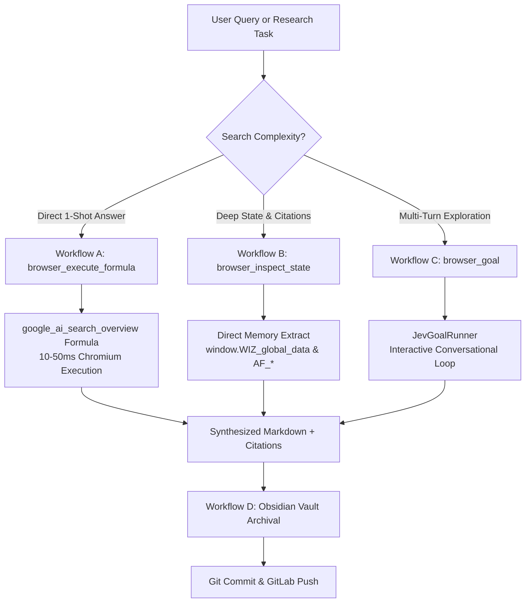
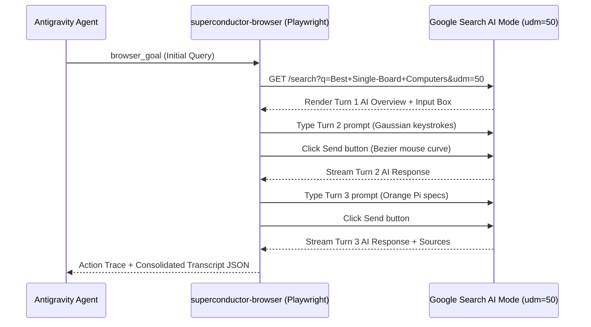

# Google Search AI Mode Skill

Autonomous research, conversational multi-turn search thread navigation, client-side WIZ hydration inspection, and Second Brain archival powered by `superconductor-browser`.

---

## 1. Overview & Protocol

### What Google Search AI Mode (`udm=50`) Is

Google Search AI Mode is Google's dedicated conversational generative search interface, activated by appending the query parameter `udm=50` to standard Google Search URLs:

```http
https://www.google.com/search?q=<query>&udm=50
```

Unlike traditional web search results (`udm=14` for web-only or default SERP), `udm=50` triggers:
- **Generative AI Overviews**: Comprehensive, multi-paragraph synthesized answers aggregating information across authoritative sources.
- **Interactive Multi-Turn Dialogue**: A conversational thread allowing iterative follow-up queries that maintain state, context, and focus.
- **Rich Source Carousels & Chips**: Interactive citation chips linking claims directly to verified publisher URLs with titles, dates, and snippets.
- **Structured Knowledge Grids**: Dynamic comparisons, hardware matrices, step-by-step instructions, and related query trees.

### Architectural Positioning in Superconductor & Design OS

`google-ai-mode` integrates directly with the **Superconductor Browser** (`@superconductor/browser`) engine to bypass brittle LLM DOM scraping and replace it with deterministic, high-speed execution:



### Key Differences from Traditional Web Scraping

| Feature | Legacy DOM Scraping | Superconductor `google-ai-mode` |
| :--- | :--- | :--- |
| **Execution Speed** | 5,000–15,000ms (full DOM parse) | **10–50ms** (compiled formula) / microsecond (WIZ) |
| **Token Consumption**| High (entire HTML in context) | **Zero tokens** for formula extraction |
| **Resilience to Redesigns**| Breaks on class change | **Self-healing** via `FormulaHealer` invariant diagnostics |
| **Multi-Turn Context** | Stateless single searches | Preserves thread session state and conversational memory |
| **Anti-Bot Resistance** | Blocked by Google bot filters | **FingerprintHardener** + Bezier mouse physics + human typing |
| **Knowledge Archival** | ephemeral CLI output | Auto-formatted into Obsidian Second Brain with GitLab sync |

---

## 2. Core Capabilities & Workflows

### Workflow A: Direct Search & AI Overview Extraction

Used when a single search query requires a clean, authoritative AI synthesis along with source citations.

#### Technical Details
- **URL Pattern**: `https://www.google.com/search?q=${encodeURIComponent(query)}&udm=50`
- **MCP Tool**: `browser_execute_formula`
- **Formula ID**: `google_ai_search_overview` (persisted in `.superconductor/formulas/google_ai_search_overview.json`)
- **Extracted Fields**:
  - `overview`: Full Markdown transcription of the AI Overview response body.
  - `sources`: Array of cited URLs extracted from interactive citation chips (`a[data-ved]`, `.show-more-chips a`, `div.V3FYCf a`, `.source-chip`).
  - `follow_ups`: Suggested follow-up queries and related search topics.
  - `query`: The active search query reflected in the input form.
- **Invariants Enforced**:
  - `minItems: 1`
  - `requiredFields: ["overview", "sources"]`
- **Drift Healing**: If Google mutates DOM class names, `FormulaHealer` detects invariant breakage, diagnoses candidate container nodes, and proposes auto-healing patches.

#### Tool Invocation Example
```json
{
  "ServerName": "superconductor-browser",
  "ToolName": "browser_execute_formula",
  "Arguments": {
    "url": "https://www.google.com/search?q=when+is+gemini+4+coming+to+ultra+users&udm=50",
    "formulaId": "google_ai_search_overview"
  }
}
```

#### Expected Execution Response
```json
{
  "success": true,
  "data": [
    {
      "overview": "Google has not yet announced a specific release date for when Gemini 4 Argon will become available to Google AI Ultra subscribers. While Google officially unveiled the Gemini 4 Argon frontier model on September 30, 2026, the initial rollout is strictly limited to cybersecurity defenders and internal teams via the Google Fairwind Program...",
      "sources": [
        "https://blog.google/technology/ai/gemini-4-argon/",
        "https://smartscope.blog/gemini-4-argon-release-date/",
        "https://arstechnica.com/ai/google-announces-gemini-4-argon/"
      ],
      "follow_ups": [
        "What are the Gemini 4 Argon benchmarks?",
        "How to join Google Fairwind Program?",
        "Google AI Ultra pricing updates 2026"
      ],
      "query": "when is gemini 4 coming to ultra users"
    }
  ],
  "executionTimeMs": 32,
  "driftDetected": false
}
```

---

### Workflow B: Client-Side JS State & Hydration Inspection (WIZ)

Used when extracting low-level metadata, citation arrays, query tracking IDs, or server response payloads without querying the DOM.

#### Technical Details
Google's modern search UI is built upon the **WIZ** web framework, which hydrates rich search states into memory via:
- `window.WIZ_global_data`: Global application configuration, session IDs, base URLs, and locale parameters.
- `window.AF_dataServiceRequests`: Pre-registered data service endpoints and pending async queries.
- `window._af_data_callbacks` / `AF_initDataCallback`: Array of serialized server responses keyed by identifier containing raw search result arrays, citation entity graphs, and latency timing.
- **URL Tracking Identifiers**: Google AI Mode URLs embed session tokens:
  - `mstk`: Multi-turn session token linking sequential queries together.
  - `mtid`: Conversation thread identifier.
  - `csuir`: Conversational search user interaction response mode.
  - `ved` / `sxsrf`: Request validation and event tracking hashes.

#### Tool Invocation Example
```json
{
  "ServerName": "superconductor-browser",
  "ToolName": "browser_inspect_state",
  "Arguments": {
    "url": "https://www.google.com/search?q=Gemini+4.0+Release+and+Rollout&udm=50",
    "path": "WIZ_global_data"
  }
}
```

Or extract the complete hydration snapshot:
```json
{
  "ServerName": "superconductor-browser",
  "ToolName": "browser_inspect_state",
  "Arguments": {
    "url": "https://www.google.com/search?q=Gemini+4.0+Release+and+Rollout&udm=50"
  }
}
```

#### Expected Inspection Output
```json
{
  "url": "https://www.google.com/search?q=Gemini+4.0+Release+and+Rollout&udm=50",
  "hydration": {
    "wiz": {
      "globalData": {
        "csuir": "1",
        "SNlM0e": "AI Mode conversation: Gemini 4.0 Release and Rollout",
        "e0sEfb": "APpeQnvfwVEfBaupsTuexCkzPP1yW9Zlqw",
        "Wp2q8e": "en-US",
        "cfb2h": "40-_as6ME7fDvr0Ph7-8oA0"
      },
      "initDataCallbacks": [
        {
          "key": "ds:0",
          "data": [
            "Gemini 4.0 Release and Rollout",
            "Google is currently aiming to release Gemini 4 much earlier than the end of 2026...",
            [
              ["YouTube·BitBiasedAI", "Gemini 4: The Truth About Google's Next AI Model"],
              ["blog.google", "Google Search I/O 2026 updates: AI agents and more"],
              ["tech-insider.org", "Gemini 4 Nears Launch as Google Trails Rivals"]
            ]
          ]
        }
      ]
    }
  }
}
```

---

### Workflow C: Multi-Turn Conversational Search

Used when conducting in-depth, progressive investigations where each query depends on the findings of previous queries (e.g., investigating a hardware matrix, narrowing down specs, or exploring technical alternatives).

#### Technical Details
- **Tool**: `browser_goal` via `JevGoalRunner`.
- **Mechanism**:
  1. The agent launches an authenticated or stealth browser session to the initial `udm=50` URL.
  2. The initial question is evaluated.
  3. The runner interacts with the conversation input elements (`textarea[aria-label='Ask about']`, input fields, or conversational prompt area).
  4. Keystrokes are entered using human latency curves (`HumanInput`).
  5. The submit action triggers search completion (`AI Mode response is ready`).
  6. The progressive turns are scraped into a unified multi-turn transcript.

#### Tool Invocation Example
```json
{
  "ServerName": "superconductor-browser",
  "ToolName": "browser_goal",
  "Arguments": {
    "url": "https://www.google.com/search?q=Best+Single-Board+Computers&udm=50",
    "goal": "Ask follow up question 'i think ARM ... with some really good AI functionality' in the AI Mode conversation thread, wait for 'AI Mode response is ready', then ask 'how good is the orange pi these days ?' and extract all conversation turns and sources.",
    "maxSteps": 15
  }
}
```

#### Multi-Turn Interaction Sequence Diagram


---

### Workflow D: Obsidian Second Brain Archival & GitLab Sync

Conversational search threads contain high-value technical intelligence and decisions. This workflow formats the multi-turn thread into a permanent Markdown document, saves it to the user's Obsidian Vault, and pushes it to GitLab.

#### Destination Structure
- **Target Vault Directory**: `/home/gooseware/repos/gemini/gemini-obsidian`
- **Target Subfolder**: `Conversations/`
- **File Naming Pattern**: `YYYY-MM-DD - <Sanitized-Query>.md` (e.g., `Conversations/2026-10-02 - Gemini 4 Release Date.md`)

#### Required YAML Frontmatter & Markdown Schema
```markdown
---
title: "Best Single-Board Computers"
source: "Google Search AI Mode"
url: "https://www.google.com/search?udm=50&q=Best+Single-Board+Computers"
extracted_at: "2026-10-02T06:35:29.880Z"
turns: 4
tags:
  - google-ai
  - search-thread
sources:
  - title: "Raspberry Pi 5"
    url: "https://www.raspberrypi.com/products/raspberry-pi-5/"
  - title: "Radxa Rock 5B+"
    url: "https://radxa.com/products/rock5/5b-plus/"
  - title: "Orange Pi 6 Plus Hands-On"
    url: "https://youtube.com/watch?v=sample"
---

# Best Single-Board Computers

> **Source:** [Google Search AI Mode](https://www.google.com/search?udm=50&q=Best+Single-Board+Computers)

---

## Turn 1 (24 September 2026)

### 👤 User

> what are the current best SBCs on the market right now ...

### 🤖 Google Search AI

The best single-board computers (SBCs) on the market offer high performance, compact sizes, and great community support...

---

## Turn 2 (24 September 2026)

### 👤 User

> i think ARM ... with some really good AI functionality

### 🤖 Google Search AI

Great choice. Transitioning to ARM architecture with dedicated Neural Processing Units (NPUs) gives you incredible performance-per-watt...

---

## Consulted Sources & Citations

1. [Raspberry Pi 5 Review](https://bret.dk/every-single-board-computer-tested/)
2. [Rockchip RK3588 AI Workloads](https://electromaker.io/top-sbc-picks/)
3. [Orange Pi 6 Plus 45 TOPS Performance](https://purplehuetechnosoft.com/orange-pi-2026-review/)
```

#### Automated Git Sync Execution
Whenever a new conversation note is written to the vault, execute the sync protocol:
```bash
cd /home/gooseware/repos/gemini/gemini-obsidian
git status --porcelain
git add "Conversations/2026-10-02 - Best Single-Board Computers.md"
git commit -m "docs(search): archive Google AI Mode conversation for 'Best Single-Board Computers'"
git push origin main
```

---

## 3. Schema Models & Data Contracts

### TypeScript Interfaces

```typescript
/**
 * Individual source chip citation extracted from Google AI Mode.
 */
export interface GoogleAiSource {
  title: string;
  url: string;
  snippet?: string;
  domain?: string;
  date?: string;
}

/**
 * A single exchange in a multi-turn Google AI conversation.
 */
export interface GoogleAiTurn {
  turnNumber: number;
  date?: string;
  userPrompt: string;
  aiResponse: string;
  sources: GoogleAiSource[];
}

/**
 * Complete multi-turn Google Search AI Mode conversation thread.
 */
export interface GoogleAiConversationThread {
  id: string;                      // Derived from query slug or mtid
  title: string;
  url: string;                     // Full udm=50 URL with tracking params
  extractedAt: string;             // ISO-8601 timestamp
  totalTurns: number;
  turns: GoogleAiTurn[];
  allSources: GoogleAiSource[];
  wizMetadata?: Record<string, any>;
}

/**
 * Direct output from the google_ai_search_overview scraper formula.
 */
export interface GoogleAiOverviewExtraction {
  overview: string;                // AI Overview Markdown
  sources: string[];               // Extracted citation URLs
  follow_ups?: string[];           // Recommended follow-up queries
  query?: string;                  // Active search query
}
```

---

## 4. Anti-Bot Stealth Hardening & Best Practices

Google Search enforces sophisticated traffic filtering, including behavioral heuristics and network anomaly detection. Automated agents must follow these anti-bot safeguards:

### 1. Built-in Stealth Profile
The Superconductor Browser MCP Server activates `FingerprintHardener` by default whenever navigating or scraping Google:
- **`navigator.webdriver` Masking**: Automatically removed from prototype chains.
- **Chrome Runtime Emulation**: Injects realistic `window.chrome.runtime` and `window.chrome.csi` methods.
- **Hardware Concurrency & Canvas/WebGL Spoofing**: Simulates genuine GPU vendor strings (`Google Inc. (NVIDIA)`), screen color depth (`24`), and plugin architectures.

### 2. Human Behavioral Mechanics
When using `browser_goal` to interact with multi-turn threads:
- **Mouse Kinematics (`MousePhysics`)**: Generates non-linear cubic Bezier curves with randomized perpendicular control points, simulating realistic motor acceleration and decelerating hover over buttons before clicking.
- **Typing Dynamics (`HumanInput`)**: Applies Gaussian-distributed inter-key flight times (60–140ms) and dwell latencies (30–50ms). Injects simulated QWERTY typo slips followed by natural pauses and backspace corrections.
- **Scroll Deceleration**: Emulates inertial trackpad flick and decelerating scroll passes with reading pauses (saccades) of 1,200–3,000ms.

### 3. Session Authentication & Profile Management
- Store authenticated Google credentials or browser context in `.superconductor/auth-profiles/google.json`.
- When accessing personalized features (e.g. "Personalization", "Notebooks", "Saved Threads"), launch Chromium with the authenticated profile context:
  ```json
  {
    "profile": "google",
    "headless": true
  }
  ```

### 4. Rate-Limiting & Jitter
- Enforce an inter-query pause of **3,000–7,000ms** between sequential multi-turn prompts.
- Avoid bursts of more than 5 rapid searches within 60 seconds from the same IP address.

### 5. Detecting & Handling JavaScript Challenges
If Google returns a redirect to:
```http
/httpservice/retry/enablejs?sei=...
```
This indicates the headless browser context is executing without full JavaScript evaluation or failed a client-side execution challenge.
**Remediation**:
1. Ensure `headless: true` uses Playwright's new headless mode (`--headless=new`).
2. Verify `--disable-blink-features=AutomationControlled` is present in Chromium launch arguments.
3. If an interactive reCAPTCHA is presented, yield control to the user via manual takeover or authenticated session bridge.

---

## 5. Concrete MCP Tool Call Playbook

### Scenario 1: Quick Technical Fact Extraction

**Agent Goal**: Look up the release status and rollout phases of Gemini 4 Argon.

```json
{
  "ServerName": "superconductor-browser",
  "ToolName": "browser_execute_formula",
  "Arguments": {
    "url": "https://www.google.com/search?q=Gemini+4+Argon+release+date+rollout&udm=50",
    "formulaId": "google_ai_search_overview"
  }
}
```

### Scenario 2: Deep Metadata & Citation Harvesting

**Agent Goal**: Extract low-level data service responses to find publisher links and internal query IDs.

```json
{
  "ServerName": "superconductor-browser",
  "ToolName": "browser_inspect_state",
  "Arguments": {
    "url": "https://www.google.com/search?q=best+single+board+computers+for+ai+2026&udm=50"
  }
}
```

### Scenario 3: Complex Multi-Turn Exploration & Archival

**Agent Goal**: Conduct a 3-turn interactive technical inquiry and archive the result to the Obsidian Second Brain.

1. **Execute Conversational Goal**:
   ```json
   {
     "ServerName": "superconductor-browser",
     "ToolName": "browser_goal",
     "Arguments": {
       "url": "https://www.google.com/search?q=TikTok+style+video+architecture+on+Cloudflare&udm=50",
       "goal": "Review the AI Overview on Cloudflare video architecture. Then ask follow up question 'what if I combine R2 and Wasabi for 3 month old content to stay within guidelines?'. Extract full conversation and sources.",
       "maxSteps": 12
     }
   }
   ```

2. **Save Note to Vault**:
   Write formatted markdown to:
   `/home/gooseware/repos/gemini/gemini-obsidian/Conversations/2026-10-03 - TikTok Video Architecture on Cloudflare.md`

3. **Sync to GitLab**:
   Execute `git add`, `git commit`, and `git push` in `/home/gooseware/repos/gemini/gemini-obsidian`.

---

## 6. Integration with Superconductor Swarm

When working on Superconductor tracks:
- **Dreamer & Architects**: Use `google-ai-mode` during the planning phase to benchmark current APIs, hardware specifications, library alternatives, and release roadmaps.
- **Coding Agents / Processors**: Use `google-ai-mode` to query esoteric compiler errors, framework deprecations, or emerging CVE security patches with verified publisher links.
- **Reviewers**: Use `google-ai-mode` to verify whether third-party dependency versions cited in implementation plans are currently released and supported.
