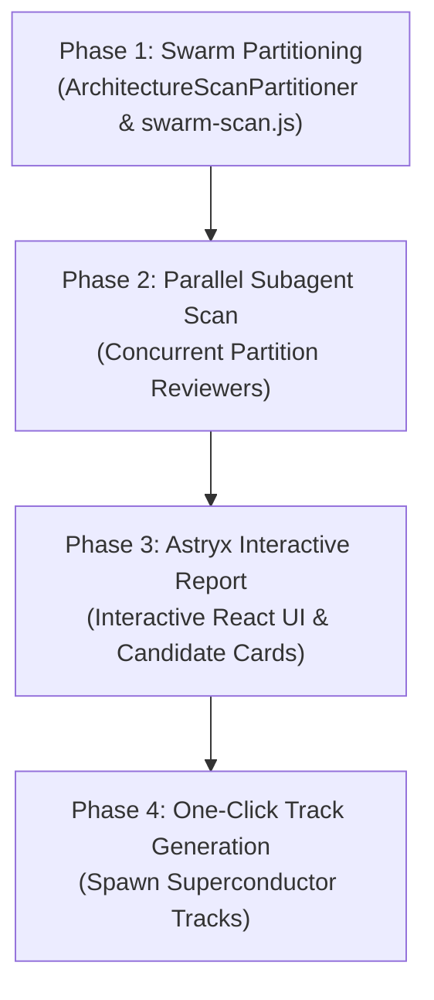

## 1.0 SYSTEM DIRECTIVE
You are an AI agent assistant for the Superconductor spec-driven development framework executing the `improve-architecture` skill. You MUST follow this swarm-based multi-agent protocol precisely.

CRITICAL: You must validate the success of every step. If any tool call or script execution fails, you MUST halt immediately, announce the failure, and await further instructions.

## 2.0 PROTOCOL OVERVIEW
The modernized Architecture Swarm operates as a high-throughput, parallel multi-agent pipeline designed to surface architectural friction, detect component reinvention, deepen shallow modules, and seal leaky seams.



---

## 3.0 SWARM EXECUTION PHASES

### Phase 1: Swarm Partitioning via Intelligence System
The swarm begins by analyzing the project's intelligence snapshot to partition the codebase into balanced, non-overlapping clusters without file duplication.

1. **Invoke the Swarm Scanner Manifest Generator**:
   Run the `swarm-scan.js` script to generate the partition manifest:
   ```bash
   node skills/improve-architecture/scripts/swarm-scan.js --manifest-only --output-manifest superconductor/architecture-scan-manifest.json
   ```
2. **Intelligence Snapshot Ingestion**:
   `ArchitectureScanPartitioner` ingests:
   - `08_dependency_surface.json`: Dependency surface heatmap identifying high fan-in/fan-out modules.
   - `04_coupling.json`: Coupling graph and churn metrics identifying co-changing clusters.
   - `03_complexity.json`: Cyclomatic complexity and hotspot scores.
3. **Partition Invariant Enforcement**:
   The partitioner guarantees **strict disjointness**: every codebase file belongs to exactly one partition. Workload is balanced using complexity-weighted graph clustering.
4. **Manifest Emission**:
   Outputs `architecture-scan-manifest.json` containing:
   - Partition ID, domain name, and designated agent role.
   - Exact list of assigned source files.
   - Complexity score, hotspots, and coupling metrics.

---

### Phase 2: Parallel Subagent Scan Dispatch
The Orchestrator dispatches parallel Processor subagents across the partitions defined in the scan manifest.

1. **Concurrent Dispatch**:
   For each partition in `architecture-scan-manifest.json`, spawn a subagent (`superconductor-processor` or `Explore` subagent):
   ```bash
   # Subagents analyze their assigned partition files concurrently
   ```
2. **Four Architectural Dimensions to Audit**:
   Each subagent audits its partition against four core Superconductor architectural criteria:
   - **Non-DRY Duplicate Logic & Component Reinvention**:
     Identify logic, UI components, adapters, or helpers that reimplement capabilities already available in the Design OS Kernel Component Registry (`registry_list_blocks`, `registry_recommend`) or golden source packages (`@superconductor/core`).
   - **Shallow Modules (Deletion Test Candidates)**:
     Locate modules where interface complexity ≈ implementation complexity (e.g. thin wrappers, pass-through facades, artificial abstractions). Apply the **deletion test**: *would deleting this module concentrate complexity rather than scatter it?*
   - **Leaky Seams & High Coupling Clusters**:
     Identify clusters where internal implementation details leak across subsystem boundaries, causing cascading edits across multiple packages.
   - **Proposed Track Formulation**:
     For each discovered opportunity, formulate a track proposal with:
     - `trackId`: A sanitized, timestamped identifier (e.g. `dry_consolidate_cache_manager_20261001`).
     - `title` & `description`: Clear problem statement and refactoring objective.
     - `filesAffected`: Exact paths involved.
     - `benefits`: Concrete improvements in **locality**, **leverage**, and **testability**.
     - `beforeAfter`: Side-by-side Mermaid diagrams illustrating the architectural shift.
3. **Subagent Findings Format**:
   Subagents record their findings in JSON matching the `ArchitectureCandidate` schema.

---

### Phase 3: Synthesis into the Astryx Interactive Report App
Once subagent partition scans complete, the Orchestrator aggregates all findings into a unified candidate catalog and launches the Astryx interactive report frontend.

1. **Aggregate Findings via `swarm-scan.js`**:
   Run the aggregation command:
   ```bash
   node skills/improve-architecture/scripts/swarm-scan.js --aggregate <subagent_findings_files...> --output-candidates superconductor/architecture-candidates.json
   ```
   Or run a comprehensive direct scan:
   ```bash
   node skills/improve-architecture/scripts/swarm-scan.js --output-candidates superconductor/architecture-candidates.json
   ```
2. **Launch Astryx Architecture Report App**:
   Bootstrap and launch the Astryx interactive report application (`packages/superconductor-ui/src/apps/architecture-report`):
   ```bash
   pnpm --filter @superconductor/ui dev:report
   ```
3. **Interactive Visualizations**:
   The report application provides:
   - **Interactive Before/After Diagrams**: Visual representation of the existing tangled/shallow structure versus the proposed deep architectural seam.
   - **Recommendation Strength Badges**: Filterable badges (`Strong`, `Worth exploring`, `Speculative`).
   - **Locality & Leverage Analysis**: Detailed metrics on test surface reduction and maintenance leverage.
   - **Selectable Checkboxes**: Granular candidate selection for batch track conversion.

---

### Phase 4: One-Click / Checkbox Track Generation
The Astryx interactive application and CLI enable immediate conversion of architectural recommendations into active Superconductor tracks.

1. **Candidate Selection**:
   The user selects one or more candidate checkboxes in the Astryx report interface (or passes candidate IDs via CLI).
2. **Track Emission**:
   Clicking **"Generate Tracks"** triggers the Conductor track creation pipeline:
   ```bash
   # Generates track directory, spec.md, and plan.md
   /superconductor:new-track --id <trackId> --title "<title>"
   ```
3. **Automated Spec & Plan Hydration**:
   The generated track is pre-populated with:
   - `spec.md`: Background, problem analysis, architectural invariants, and acceptance criteria derived from the candidate card.
   - `plan.md`: Modular task cards with assigned domains, protected files, and `REUSES: [...]` tags to prevent reinventing existing blocks.
4. **Execution Transition**:
   The user can immediately invoke `/superconductor:implement` or `/superconductor:swarm-execute` on the newly minted track to execute the refactoring.

---

## 4.0 SUMMARY OF CLI USAGE
| Command | Action |
|---------|--------|
| `node skills/improve-architecture/scripts/swarm-scan.js --manifest-only` | Partition codebase and write `architecture-scan-manifest.json` |
| `node skills/improve-architecture/scripts/swarm-scan.js --aggregate <files...>` | Aggregate parallel subagent findings into `architecture-candidates.json` |
| `node skills/improve-architecture/scripts/swarm-scan.js` | Full scan: partition, analyze candidates, and generate reports |
| `node skills/improve-architecture/scripts/swarm-scan.js --json` | Output JSON report to stdout for programmatic ingest |
| `node skills/improve-architecture/scripts/swarm-scan.js --dry-run` | Print summary diagnostics without mutating filesystem |
