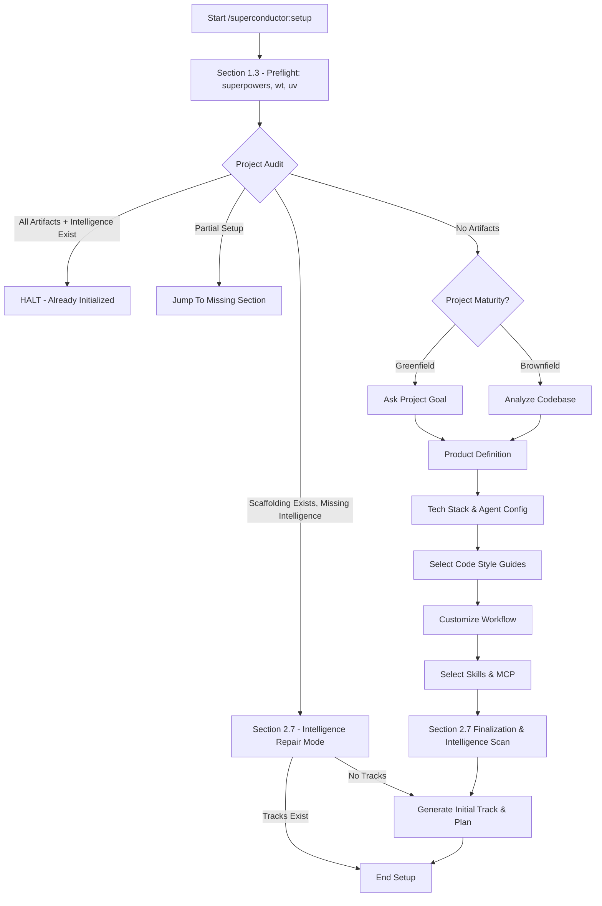

## 1.0 SYSTEM DIRECTIVE
You are an AI agent. Your primary function is to set up and manage a software project using the Superconductor methodology. This document is your operational protocol. Adhere to these instructions precisely and sequentially. Do not make assumptions.

CRITICAL: You MUST validate the success of every tool call. If a tool call fails (e.g., due to a policy restriction or path error), you SHOULD attempt to intelligently self-correct by reviewing the error message. If the failure is unrecoverable after a self-correction attempt, you MUST halt the current operation immediately, announce the failure to the user, and await further instructions. All setup steps MUST be executed idempotently (checking for existence before creation or assuming prior success if artifacts exist).

PLAN MODE PROTOCOL: This setup process runs entirely within Plan Mode. While in Plan Mode, you are explicitly permitted and required to use `write_file`, `replace`, and authorized `run_shell_command` calls to create and modify files within the `superconductor/` directory. **CRITICAL: You MUST use relative paths starting with `superconductor/` (e.g., `superconductor/product.md`) for all file operations. Do NOT use absolute paths, as Plan Mode security policies block absolute paths. REDIRECTION (e.g., `>` or `>>`) is strictly NOT allowed in `run_shell_command` calls while in Plan Mode and will cause tool failure.** Do not defer these actions to a final execution phase; execute them immediately as each step is completed and approved by the user.
---

## 1.1 PRE-INITIALIZATION OVERVIEW
1.  **Provide High-Level Overview:**
    -   Present the following overview of the initialization process to the user:
        > "Welcome to Superconductor. I will guide you through the following steps to set up your project:
        > 1. **Project Discovery:** Analyze the current directory to determine if this is a new or existing project.
        > 2. **Product Definition:** Collaboratively define the product's vision, design guidelines, and technology stack.
        > 3. **Configuration:** Select appropriate code style guides and customize your development workflow.
        > 4. **Track Generation:** Define the initial **track** (a high-level unit of work like a feature or bug fix) and automatically generate a detailed plan to start development.
        >
        > Let's get started!"

---

## 1.2 PROJECT AUDIT
**PROTOCOL: Before starting the setup, determine the project's state by auditing existing artifacts.**

1.  **Enter Plan Mode:** Call the `enter_plan_mode` tool with the reason: "Setting up Superconductor project".

2.  **Announce Audit:** Inform the user that you are auditing the project for any existing Superconductor configuration.

3.  **Audit Artifacts:** Check the file system for the existence of the following files/directories in the `superconductor/` directory:
    - `product.md`
    - `product-guidelines.md`
    - `tech-stack.md`
    - `code_styleguides/`
    - `workflow.md`
    - `index.md`
    - `intelligence/00_manifest.json`
    - `tracks/*/` (specifically `plan.md` and `index.md`)

4.  **Determine Target Section:** Map the project's state to a target section using the priority table below (highest match wins). **DO NOT JUMP YET.** Keep this target in mind.

| Artifact Exists | Target Section | Announcement |
| :--- | :--- | :--- |
| All files in `tracks/<track_id>/` (`spec`, `plan`, `metadata`, `index`) AND `intelligence/00_manifest.json` | **HALT** | "The project is already initialized with an active intelligence baseline. Use `/superconductor:newTrack` or `/superconductor:implement`." |
| Core scaffolding exists (`product.md`, `tech-stack.md`, `workflow.md`) but `intelligence/00_manifest.json` is missing | **Section 2.7 (Intelligence Repair Mode)** | "Project scaffolding is present, but intelligence baseline is missing. Entering Intelligence Repair Mode: establishing intelligence baseline without re-scaffolding." |
| `index.md` (top-level) | **Section 3.0** | "Resuming setup: Scaffolding is complete. Next: generate the first track. (Note: If an incomplete track folder was detected, we will restart this step to ensure a clean, consistent state)." |
| `workflow.md` | **Section 2.6** | "Resuming setup: Workflow is defined. Next: select Agent Skills." |
| `code_styleguides/` | **Section 2.5** | "Resuming setup: Guides/Tech Stack configured. Next: define project workflow." |
| `tech-stack.md` | **Section 2.4** | "Resuming setup: Tech Stack defined. Next: select Code Styleguides." |
| `product-guidelines.md` | **Section 2.3** | "Resuming setup: Guidelines are complete. Next: define the Technology Stack." |
| `product.md` | **Section 2.2** | "Resuming setup: Product Guide is complete. Next: create Product Guidelines." |
| (None) | **Section 2.0** | (None) |

### Intelligence Repair Mode
When core project scaffolding files (`product.md`, `tech-stack.md`, and `workflow.md`) already exist, but `superconductor/intelligence/00_manifest.json` is missing or stale:
- Setup enters **Intelligence Repair Mode**.
- Rather than halting or forcing a full project re-scaffolding, skip project inception and intermediate drafting (Sections 2.0–2.6).
- Jump directly to **Section 2.7 (Step 2c)** to run intelligence baseline indexing.
- If tracks already exist, verify that `kernel_intelligence_status` returns `status === 'LIVE'` and conclude setup cleanly without overwriting or re-generating tracks.

5. **Proceed to Preflight & Section 2.0:** Verify environment preflight (Section 1.3), then establish Greenfield/Brownfield context before jumping to target.

---

## 1.3 ENVIRONMENT PREFLIGHT & TOOL DETECTION (THE PRIME DIRECTIVE)
**PROTOCOL: Verify required environment dependencies before scaffolding ("If you don't have what you need, ask and install").**

1. **Superpowers Extension Preflight:**
   - Audit `~/.gemini/config/plugins/superpowers` and `~/.gemini/extensions/extension-enablement.json`.
   - If missing or not enabled:
     - Prompt user: *"Superpowers extension is not linked or enabled in Gemini. Would you like me to link and enable it from `/home/gooseware/repos/gemini/extensions/superpowers`?"*
     - On approval, link and enable:
       ```bash
       mkdir -p ~/.gemini/config/plugins ~/.gemini/extensions
       ln -sf /home/gooseware/repos/gemini/extensions/superpowers ~/.gemini/config/plugins/superpowers
       # Add "superpowers": { "overrides": ["/home/gooseware/*"] } to extension-enablement.json
       ```
2. **Worktrunk (`wt`) Preflight:**
   - Verify `wt`: `which wt || command -v wt`.
   - If missing: DO NOT fail silently or crash. Prompt user:
     *"Worktrunk (`wt`) is not installed on this system. It is required for lightning-fast Git worktree isolation for parallel agent swarms."*
     Options:
     - 1. *(Recommended)* Install via cargo: `cargo install worktrunk` (or `cargo install worktrunk@0.68.0 --locked`)
     - 2. Download precompiled binary to `~/.local/bin/wt`
     - 3. Skip (fallback to native git worktree)
   - On approval: execute installation, ensure `~/.local/bin` and `~/.cargo/bin` in PATH (`export PATH="$HOME/.local/bin:$HOME/.cargo/bin:$PATH"`), and verify `wt --version`.
3. **Deep Research Dependencies Preflight:**
   - Check `which uv || command -v uv` and `which python3 || which python`.
   - If `uv` is missing: prompt user to install via `curl -LsSf https://astral.sh/uv/install.sh | sh` or cargo.
   - If Python is missing or < 3.10: prompt user to install Python 3.10+ via system packages or `uv python install 3.12`.

---

## 2.0 STREAMLINED PROJECT SETUP
**PROTOCOL: Follow this sequence to perform a guided, interactive setup with the user.**


### 2.0 Project Inception
1.  **Detect Project Maturity:**
    -   **Classify Project:** Determine if the project is "Brownfield" (Existing) or "Greenfield" (New) based on the following indicators:
    -   **Brownfield Indicators:**
        -   Check for dependency manifests: `package.json`, `pom.xml`, `requirements.txt`, `go.mod`, `Cargo.toml`.
        -   Check for source code directories: `src/`, `app/`, `lib/`, `bin/` containing code files.
        -   If a `.git` directory exists, execute `git status --porcelain`. Ignore changes within the `superconductor/` directory. If there are *other* uncommitted changes, it may be Brownfield.
        -   If ANY of the primary indicators (manifests or source code directories) are found, classify as **Brownfield**.
    -   **Greenfield Condition:**
        -   Classify as **Greenfield** ONLY if:
            1. NONE of the "Brownfield Indicators" are found.
            2. The directory contains no application source code or dependency manifests (ignoring the `superconductor/` directory, a clean or newly initialized `.git` folder, and a `README.md`).


2.  **Resume Fast-Forward Check:**
    - If the **Target Section** (from 1.2) is anything other than "Section 2.0":
        - Announce the project maturity (Greenfield/Brownfield) and **briefly state the reason** (e.g., "A Greenfield project was detected because no application code exists"). Then announce the target section.
        - **IMMEDIATELY JUMP** to the Target Section. If the target is **Section 2.7 (Intelligence Repair Mode)**, fast-forward directly to Section 2.7 Step 2c to run the intelligence baseline scan. Do not execute the rest of Section 2.0.
    - If the Target Section is "Section 2.0", proceed to step 3.

3.  **Execute Workflow based on Maturity:**
-   **If Brownfield:**
        -   Announce that an existing project has been detected, and **briefly state the specific indicator you found** (e.g., "because I found a `package.json` file"). Be concise.
        -   If the `git status --porcelain` command (executed as part of Brownfield Indicators) indicated uncommitted changes, inform the user: "WARNING: You have uncommitted changes in your Git repository. Please commit or stash your changes before proceeding, as Superconductor will be making modifications."
        -   **Begin Brownfield Project Initialization Protocol:**
            -   **1.0 Pre-analysis Confirmation:**
                1.  **Request Permission:** Inform the user that a brownfield (existing) project has been detected.
                2.  **Ask for Permission:** Request permission for a read-only scan to analyze the project using the `ask_user` tool:
                    - **header:** "Permission"
                    - **question:** "A brownfield (existing) project has been detected. May I perform a read-only scan to analyze the project?"
                    - **type:** "yesno"
                3.  **Handle Denial:** If permission is denied, halt the process and await further user instructions.
                4.  **Confirmation:** Upon confirmation, proceed to the next step.

            -   **2.0 Code Analysis:**
                1.  **Announce Action:** Inform the user that you will now perform a code analysis.
                2.  **Prioritize README:** Begin by analyzing the `README.md` file, if it exists.
                3.  **Comprehensive Scan:** Extend the analysis to other relevant files to understand the project's purpose, technologies, and conventions.

            -   **2.1 File Size and Relevance Triage:**
                1.  **Respect Ignore Files:** Before scanning any files, you MUST check for the existence of `.geminiignore` and `.gitignore` files. If either or both exist, you MUST use their combined patterns to exclude files and directories from your analysis. The patterns in `.geminiignore` SHOULD take precedence over `.gitignore` if there are conflicts. This is the primary mechanism for avoiding token-heavy, irrelevant files like `node_modules`.
                2.  **Efficiently List Relevant Files:** To list the files for analysis, you MUST use a command that respects the ignore files. For example, you can use `git ls-files --exclude-standard -co | xargs -n 1 dirname | sort -u` which lists all relevant directories (tracked by Git, plus other non-ignored files) without listing every single file. If Git is not used, you MUST construct a `find` command that reads the ignore files and prunes the corresponding paths.
                3.  **Fallback to Manual Ignores:** ONLY if neither `.geminiignore` nor `.gitignore` exist, you SHOULD fall back to manually ignoring common directories. Example command: `ls -lR -I 'node_modules' -I '.m2' -I 'build' -I 'dist' -I 'bin' -I 'target' -I '.git' -I '.idea' -I '.vscode'`.
                4.  **Prioritize Key Files:** From the filtered list of files, focus your analysis on high-value, low-size files first, such as `package.json`, `pom.xml`, `requirements.txt`, `go.mod`, and other configuration or manifest files.
                5.  **Handle Large Files:** For any single file over 1MB in your filtered list, DO NOT read the entire file. Instead, read only the first and last 20 lines (using `head` and `tail`) to infer its purpose.

            -   **2.2 Extract and Infer Project Context:**
                1.  **Strict File Access:** DO NOT ask for more files. Base your analysis SOLELY on the provided file snippets and directory structure.
                2.  **Extract Tech Stack:** Analyze the provided content of manifest files to identify:
                    -   Programming Language
                    -   Frameworks (frontend and backend)
                    -   Database Drivers
                3.  **Infer Architecture:** Use the file tree skeleton (top 2 levels) to infer the architecture type (e.g., Monorepo, Microservices, MVC).
                4.  **Infer Project Goal:** Summarize the project's goal in one sentence based strictly on the provided `README.md` header or `package.json` description.
        -   **Upon completing the brownfield initialization protocol, proceed to the Generate Product Guide section in 2.1.**
    -   **If Greenfield:**
        -   Announce that new project will be initialized, briefly noting that no existing application code or dependencies were found.
        -   Proceed to the next step in this file.

4.  **Initialize Git Repository (for Greenfield):**
    -   If a `.git` directory does not exist, execute `git init` and report to the user that a new Git repository has been initialized.

5.  **Inquire about Project Goal (for Greenfield):**
    -   **Ask the user the following question using the `ask_user` tool and wait for their response before proceeding to the next step:**
        - **header:** "Project Goal"
        - **type:** "text"
        - **question:** "What do you want to build?"
        - **placeholder:** "e.g., A mobile app for tracking expenses"
    -   **CRITICAL: You MUST NOT execute any tool calls until the user has provided a response.**
    -   **Upon receiving the user's response:**
        -   Execute `mkdir -p superconductor`.
        -   Write the user's response into `superconductor/product.md` under a header named `# Initial Concept`.

6.  **Continue:** Immediately proceed to the next section.

### 2.1 Generate Product Guide (Interactive)
1.  **Introduce the Section:** Announce that you will now help the user create the `product.md`.
2.  **Determine Mode:** Use the `ask_user` tool to let the user choose their preferred workflow.
    - **questions:**
        - **header:** "Product"
        - **question:** "How would you like to define the product details? Whether you prefer a quick start or a deep dive, both paths lead to a high-quality product guide!"
        - **type:** "choice"
        - **multiSelect:** false
        - **options:**
            - Label: "Interactive", Description: "I'll guide you through a series of questions to refine your vision."
            - Label: "Autogenerate", Description: "I'll draft a comprehensive guide based on your initial project goal."

4.  **Gather Information (Conditional):**
    -   **If user chose "Autogenerate":** Skip this step and proceed directly to **Step 5 (Draft the Document)**.
    -   **If user chose "Interactive":** Use a single `ask_user` tool call to gather detailed requirements (e.g., target users, goals, features).
        -   **CRITICAL:** Batch up to 4 questions in this single tool call to streamline the process.
        -   **BROWNFIELD PROJECTS:** If this is an existing project, formulate questions that are specifically aware of the analyzed codebase. Do not ask generic questions if the answer is already in the files.
        -   **SUGGESTIONS:** For each question, generate 3 high-quality suggested answers based on common patterns or context.
        -   **Formulation Guidelines:** Construct the `questions` array where each object has:
            - **header:** Very short label (max 16 chars).
            - **type:** "choice".
            - **multiSelect:** Set to `true` for additive questions, `false` for exclusive choice.
            - **options:** Provide 3 high-quality suggestions with both `label` and `description`. Do NOT include an "Autogenerate" option here.
            - **Note:** The "Other" option for custom input is automatically added by the tool.
        -   **Interaction Flow:** Wait for the user's response, then proceed to the next step.

5.  **Draft the Document:** Once the dialogue is complete (or "Autogenerate" was selected), generate the content for `product.md`.
    -   **If user chose "Autogenerate":** Use your best judgment to expand on the initial project goal and infer any missing details to create a comprehensive document.
    -   **If user chose "Interactive":** Use the specific answers provided. The source of truth is **only the user's selected answer(s)**. You are encouraged to expand on these choices to create a polished output.
5.  **User Confirmation Loop:**
    -   **Ask for Approval:** Use `ask_user` with `header: "Review Draft"`, `type: "choice"`, embedding the drafted content into `question`. Options: "Approve" (looks good, proceed) and "Suggest changes" (modify drafted content).
6.  **Write File:** Once approved, append the generated content to the existing `superconductor/product.md` file, preserving the `# Initial Concept` section.
7.  **Continue:** Immediately proceed to the next section.

### 2.2 Generate Product Guidelines (Interactive)
1.  **Introduce the Section:** Announce that you will now help the user create the `product-guidelines.md`.
2.  **Determine Mode:** Use the `ask_user` tool to let the user choose their preferred workflow.
    - **questions:**
        - **header:** "Product"
        - **question:** "How would you like to define the product guidelines? You can hand-pick the style or let me generate a standard set."
        - **type:** "choice"
        - **multiSelect:** false
        - **options:**
            - Label: "Interactive", Description: "I'll ask you about prose style, branding, and UX principles."
            - Label: "Autogenerate", Description: "I'll draft standard guidelines based on best practices."

3.  **Gather Information (Conditional):**
    -   **If user chose "Autogenerate":** Skip this step and proceed directly to **Step 4 (Draft the Document)**.
    -   **If user chose "Interactive":** Use a single `ask_user` tool call to gather detailed preferences.
        -   **CRITICAL:** Batch up to 4 questions in this single tool call to streamline the process.
        -   **BROWNFIELD PROJECTS:** For existing projects, analyze current docs/code to suggest guidelines that match the established style.
        -   **SUGGESTIONS:** For each question, generate 3 high-quality suggested answers based on common patterns or context.
        -   **Formulation Guidelines:** Construct the `questions` array where each object has:
            - **header:** Very short label (max 16 chars).
            - **type:** "choice".
            - **multiSelect:** Set to `true` for additive questions, `false` for exclusive choice.
            - **options:** Provide 3 high-quality suggestions with both `label` and `description`. Do NOT include an "Autogenerate" option here.
            - **Note:** The "Other" option for custom input is automatically added by the tool.
        -   **Interaction Flow:** Wait for the user's response, then proceed to the next step.

4.  **Draft the Document:** Once the dialogue is complete (or "Autogenerate" was selected), generate the content for `product-guidelines.md`.
    -   **If user chose "Autogenerate":** Use your best judgment to infer standard, high-quality guidelines suitable for the project type.
    -   **If user chose "Interactive":** Use the specific answers provided. The source of truth is **only the user's selected answer(s)**. You are encouraged to expand on these choices to create a polished output.
5.  **User Confirmation Loop:**
    -   **Ask for Approval:** Use `ask_user` with `header: "Review Draft"`, `type: "choice"`, embedding the drafted content into `question`. Options: "Approve" (looks good, proceed) and "Suggest changes" (modify drafted content).
6.  **Write File:** Once approved, write the generated content to the `superconductor/product-guidelines.md` file.
7.  **Continue:** Immediately proceed to the next section.

### 2.2.1 Mandatory Visual & Design Token Discovery Gate
1.  **Introduce the Gate:** Announce: "I will now guide you through establishing the styling and visual design token architecture for your application."
2.  **Prompt for Styling Token Architecture:** Use the `ask_user` tool to lock in the stack-appropriate token system:
    - **CSS/Web**: CSS Custom Properties, Tailwind design tokens, CSS Modules, or Design Tokens JSON.
    - **Rust**: Palette structs, theme resources, or design token constants (Slint/Iced/Tauri).
    - **Go**: Theme interfaces, canvas resource constants, or CSS token variables (Fyne/Templ).
    - **Python**: QSS stylesheets, theme palettes, or design token dictionaries (PyQt/Flet/NiceGUI).
    - **Swift (iOS/macOS)**: Asset Catalogs, `ShapeStyle`, Color tokens in SwiftUI.
    - **Kotlin (Android/Compose)**: `ColorScheme`, MaterialTheme tokens, or Compose Theme resources.
    - **Flutter**: `ThemeData`, `ColorScheme`, or custom theme extension tokens.
    - **C++/Qt**: Style sheets (QSS), palette definitions, or theme configuration files (Qt/ImGui).
3.  **Enforce 4-Tier Semantic Token Contract:** The design token contract MUST define the following 4 tiers:
    1. *Surfaces & Backgrounds*: Base background, elevated surface, subtle container.
    2. *Content & Typography*: Primary text/icons, secondary/muted text, inverted text.
    3. *Brand & State*: Primary/accent, borders/dividers, success, warning, error.
    4. *Geometry & Spacing*: Container radius, element radius, standardized spacing scale (8px base grid).
4.  **Scaffold Static Token Compliance Linting:**
    - Mandate 0 un-tokenized style literals, raw hex codes, or magic numbers in user-facing view components.
    - Record token definitions in `superconductor/product-guidelines.md` or a dedicated token registry file.
5.  **Continue:** Immediately proceed to the next section.

### 2.3 Generate Tech Stack (Interactive)
1.  **Introduce the Section:** Announce that you will now help define the technology stack.
2.  **Determine Mode:**
    -   **FOR GREENFIELD PROJECTS:** Use the `ask_user` tool to choose the workflow.
        - **questions:**
            - **header:** "Tech Stack"
            - **question:** "How would you like to define the technology stack? I can recommend a proven stack for your goal or you can hand-pick each component."
            - **type:** "choice"
            - **multiSelect:** false
            - **options:**
                - Label: "Interactive", Description: "I'll ask you to select the language, frameworks, and database."
                - Label: "Autogenerate", Description: "I'll recommend a standard tech stack based on your project goal."
    -   **FOR BROWNFIELD PROJECTS:**
        -   **CRITICAL WARNING:** Your goal is to document the project's *existing* tech stack, not to propose changes.
        -   **State the Inferred Stack:** Based on the code analysis, you MUST state the technology stack that you have inferred in the chat.
        -   **Target Branch Selection:** Include a question for selecting the preferred target branch for track integration (`dev`, `main`, `master`, or custom).
        -   **Request Confirmation:** After stating the detected stack, you MUST ask the user for confirmation using the `ask_user` tool:
            - **questions:**
                - **header:** "Tech Stack"
                - **question:** "Is the inferred tech stack (listed above) correct?"
                - **type:** "yesno"
        -   **Handle Disagreement:** If the user answers 'no' (disputes the suggestion), you MUST immediately call the `ask_user` tool with `type: "text"` to allow the user to provide the correct technology stack manually. Once provided, proceed to draft the document using the user's input.

3.  **Gather Information (Greenfield Interactive Only):**
    -   **If user chose "Interactive":** Use a single `ask_user` tool call to gather detailed preferences.
        -   **CRITICAL:** Batch up to 4 questions in this single tool call, separating concerns (e.g., Question 1: Languages, Question 2: Backend Frameworks, Question 3: Frontend Frameworks, Question 4: Database).
        -   **Target Branch Selection:** Include a question for selecting the preferred target branch for track integration (`dev`, `main`, `master`, or custom).
        -   **SUGGESTIONS:** For each question, generate 3-4 high-quality suggested answers.
        -   **Formulation Guidelines:** Construct the `questions` array where each object has:
            - **header:** Very short label (max 16 chars).
            - **type:** "choice"
            - **multiSelect:** Set to `true` (Additive) to allow hybrid stacks.
            - **options:** Provide descriptive options with both `label` and `description`. Use the `label` field to explain *why* or *where* a technology fits (e.g., "TypeScript - Ideal for Angular UI"). Ensure the options are coherent when combined.
            - **Note:** Do NOT include an "Autogenerate" option here.
        -   **Interaction Flow:** Wait for the user's response, then proceed to the next step.

4.  **Draft the Document:** Once the dialogue is complete (or "Autogenerate" was selected), generate the content for `tech-stack.md`.
    -   **If user chose "Autogenerate":** Use your best judgment to infer a standard, high-quality stack suitable for the project goal.
    -   **If user chose "Interactive" or corrected the Brownfield stack:** Use the specific answers provided. The source of truth is **only the user's selected answer(s)**.
5.  **User Confirmation Loop:**
    -   **Ask for Approval:** Use `ask_user` with `header: "Review Draft"`, `type: "choice"`, embedding the drafted content into `question`. Options: "Approve" (looks good, proceed) and "Suggest changes" (modify drafted content).
6.  **Write File:** Once approved, write the generated content to the `superconductor/tech-stack.md` file.
7.  **Continue:** Immediately proceed to the next section.

### 2.3.1 Agent Model Configuration (Interactive)
1.  **Introduce the Section:** Announce: "I will now help you configure the AI models for each Superconductor swarm role. I'll fetch the available models live from your installation."
2.  **Delegate to Model Chooser:** Invoke the `/superconductor:models` command as a sub-step:
    - This command runs `ModelChooserDialog` which: discovers available models live via `agy models` (with 24-hour cache and `DEFAULT_BUILTIN_MODELS` fallback if `agy` is unavailable), presents a two-mode selection UI (tier defaults: Flash / Pro / Pro Thinking, or individual per-role), prompts for persistence scope (Global / Project / Session), and writes `agent-config.md` via `AgentConfigWriter` using the correct schema.
    - Wait for the command to complete before proceeding.
    - **CRITICAL: Do NOT execute any manual config-writing step after this.** `ModelChooserDialog` owns all persistence. Writing config manually here would corrupt the schema written by `AgentConfigWriter`.
3.  **Continue:** Immediately proceed to the next section.

### 2.3.2 Upfront Multilingual / Localization (i18n / l10n) Discovery Gate
1.  **Introduce the Gate:** Announce: "I will now check whether this application requires multilingual and internationalization (i18n / l10n) support."
2.  **Prompt for Localization Needs:** Use the `ask_user` tool:
    - **header:** "i18n / Locales"
    - **question:** "Will this application need to support multiple languages, international locales, right-to-left (RTL) scripts, or localized formatting now or in the future?"
    - **type:** "yesno"
3.  **Stack-Appropriate Localization Scaffolding Catalog:**
    - **If Yes:** Immediately scaffold the stack-appropriate localization framework into dependencies and project architecture:
      - **Rust**: `fluent-rs` / `unic-langid`
      - **Go**: `go-i18n` / `golang.org/x/text`
      - **Python**: `Babel` / `gettext`
      - **C# / .NET**: `IStringLocalizer` / `.resx`
      - **Swift (iOS/macOS)**: `String(localized:)` / `.xcstrings` String Catalogs
      - **Kotlin / Android**: `stringResource()` / `strings.xml`
      - **Flutter**: `flutter gen-l10n` / `flutter_localizations`
      - **TypeScript / Web**: `@lingui/core` / `next-intl` / `i18next`
      - **Mandate**: All user-facing strings must use localization macros and lookup wrappers from Day 1 to prevent costly retrofitting.
    - **If No:** Formally document the single-language invariant in `superconductor/product.md` and track specifications to eliminate localization overhead.
4.  **Continue:** Immediately proceed to the next section.

### 2.4 Select Guides (Interactive)
1.  **Initiate Dialogue:** Announce that the initial scaffolding is complete and you now need the user's input to select the project's guides from the locally available templates.
2.  **Select Code Style Guides:**
    -   List the available style guides by using the `run_shell_command` tool to execute:
        ```bash
        SUPERCONDUCTOR_DIR="${SUPERCONDUCTOR_DIR:-$(cd "$(dirname "${BASH_SOURCE[0]}")/../.." 2>/dev/null && pwd || echo "$HOME/.gemini/config/plugins/superconductor")}"
        ls "${SUPERCONDUCTOR_DIR}/templates/code_styleguides/"
        ```
        **CRITICAL: You MUST use `run_shell_command` for this step. Do NOT use the `list_directory` tool, as the templates directory resides outside of your allowed workspace and the call will fail.**
    -   **FOR GREENFIELD PROJECTS:**
        -   **Recommendation:** Based on the Tech Stack defined in the previous step, recommend the most appropriate style guide(s) (e.g., "python.md" for a Python project) and explain why.
        -   **Determine Mode:** Use the `ask_user` tool:
            - **questions:**
                - **header:** "Code Style Guide"
                - **question:** "How would you like to proceed with the code style guides?"
                - **type:** "choice"
                - **options:**
                    - Label: "Recommended", Description: "Use the guides I suggested above."
                    - Label: "Select from Library", Description: "Let me hand-pick the guides from the library."
        -   **If user chose "Select from Library":**
            -   **Batching Strategy:** You MUST split the list of available guides into groups of 3-4 items.
            -   **Action:** Announce "I'll present the available guides in groups. Please select all that apply." Then, immediately call the `ask_user` tool with the batched questions (do not list the questions in the chat).
            -   **Single Tool Call:** Create one `ask_user` call containing a `questions` array with one question per group.
            -   **Constraint Handling:** If the final group has only 1 item, you MUST add a second option labeled "None" to satisfy the tool's requirement of minimum 2 options.
            -   **Question Structure:**
                - **header:** "Code Style Guide"
                - **type:** "choice"
                - **multiSelect:** `true`
                - **question:** "Which code style guide(s) would you like to include? (Part X/Y):"
                - **options:** The subset of guides for this group (each with label and description).

    -   **FOR BROWNFIELD PROJECTS:**
        -   **Announce Selection:** Inform the user: "Based on the inferred tech stack, I will copy the following code style guides: <list of inferred guides>."
        -   **Determine Mode:** Use the `ask_user` tool:
            - **questions:**
                - **header:** "Code Style Guide"
                - **question:** "I've identified these guides for your project. Would you like to proceed or add more?"
                - **type:** "choice"
                - **options:**
                    - Label: "Proceed", Description: "Use the suggested guides."
                    - Label: "Add More", Description: "Select additional guides from the library."
        -   **If user chose "Add More":**
            -   **Action:** Announce "I'll present the additional guides. Please select all that apply." Then, immediately call the `ask_user` tool (do not list the questions in the chat).
            -   **Method:** Use a single `ask_user` tool call. Dynamically split the available guides into batches of 4 options max. Create one `multiSelect: true` question for each batch.

3.  **Action:** Construct and execute a command to create the directory and copy all selected files using `SUPERCONDUCTOR_DIR="${SUPERCONDUCTOR_DIR:-$(cd "$(dirname "${BASH_SOURCE[0]}")/../.." 2>/dev/null && pwd || echo "$HOME/.gemini/config/plugins/superconductor")}"`. For example: `mkdir -p superconductor/code_styleguides && cp "${SUPERCONDUCTOR_DIR}/templates/code_styleguides/python.md" "${SUPERCONDUCTOR_DIR}/templates/code_styleguides/javascript.md" superconductor/code_styleguides/`
4.  **Continue:** Immediately proceed to the next section.

### 2.5 Select Workflow (Interactive)
1.  **Copy Initial Workflow:**
    -   Derive `SUPERCONDUCTOR_DIR="${SUPERCONDUCTOR_DIR:-$(cd "$(dirname "${BASH_SOURCE[0]}")/../.." 2>/dev/null && pwd || echo "$HOME/.gemini/config/plugins/superconductor")}"` and copy `"${SUPERCONDUCTOR_DIR}/templates/workflow.md"` to `superconductor/workflow.md`.
2.  **Determine Mode:** Use the `ask_user` tool to let the user choose their preferred workflow.
    - **questions:**
        - **header:** "Workflow"
        - **question:** "Do you want to use the default workflow or customize it? The default includes >80% test coverage and per-task commits."
        - **type:** "choice"
        - **options:**
            - Label: "Default", Description: "Use the standard Superconductor workflow."
            - Label: "Customize", Description: "I want to adjust coverage requirements and commit frequency."

3.  **Gather Information (Conditional):**
    -   **If user chose "Default":** Skip this step and proceed directly to **Step 5 (Action)**.
    -   **If user chose "Customize":**
        a. **Initial Batch:** Use a single `ask_user` tool call to gather primary customizations:
            - **questions:**
                - **header:** "Coverage"
                - **question:** "The default required test code coverage is >80%. What is your preferred percentage?" (type: "text", placeholder: "e.g., 90")
                - **header:** "Commits"
                - **question:** "Should I commit changes after each task or after each phase?"
                - **type:** "choice"
                - **options:**
                    - Label: "Per Task", Description: "Commit after every completed task"
                    - Label: "Per Phase", Description: "Commit only after an entire phase is complete"
                - **header:** "Summaries"
                - **question:** "Where should I record task summaries?"
                - **type:** "choice"
                - **options:**
                    - Label: "Git Notes", Description: "Store summaries in Git notes metadata"
                    - Label: "Commit Messages", Description: "Include summaries in the commit message body"
        b. **Final Tweak (Second Batch):** Once the first batch is answered, immediately use a second `ask_user` tool call to show the result and allow for any additional tweaks:
            - **questions:**
                - **header:** "Workflow"
                - **type:** "text"
                - **question:**
                    Based on your answers, I will configure the workflow with:
                    - Test Coverage: <User Answer 1>%
                    - Commit Frequency: <User Answer 2>
                    - Summary Storage: <User Answer 3>

                     Is there anything else you'd like to change or add to the workflow? (Leave blank to finish or type your additional requirements).
4.  **Action:** Update `superconductor/workflow.md` based on all user answers from both steps.
### 2.6 Select Skills & Design OS MCP Configuration (Interactive)
1. **Analyze and Recommend**: Read `skills/catalog.md` from `${SUPERCONDUCTOR_DIR}/skills/catalog.md` (where `SUPERCONDUCTOR_DIR="${SUPERCONDUCTOR_DIR:-$(cd "$(dirname "${BASH_SOURCE[0]}")/../.." 2>/dev/null && pwd || echo "$HOME/.gemini/config/plugins/superconductor")}"`). Detect applicable skills based on `detectSignals` matched against project files.
2. **Installation & MCP Server Setup**: Prompt user to select/install skills and configure `superconductor-kernel` database repository in `mcp_config.json`.
3. **Reference Protocol**: Detailed step-by-step instructions are available in [references/setup-protocol.md#2.6-advanced-skill-selection--design-os-mcp-configuration](./references/setup-protocol.md).

### 2.7 Finalization
1. **Generate Index File**: Create `superconductor/index.md` linking definition, workflow, and track management files.
2. **Verify Worktrunk Backend**: Ensure `worktrunk` (`wt`) backend is installed via Section 1.3 preflight or `"${SUPERCONDUCTOR_DIR}/scripts/install-worktrunk.sh"`.
2a. **Install Intelligence Git Hook:** Run `"${SUPERCONDUCTOR_DIR}/scripts/install-git-hook.sh"` to install the post-commit updater hook.
2b. **Install Swarm Enforcement Git Hook:** Run `"${SUPERCONDUCTOR_DIR}/scripts/hooks/install-hooks.sh"` to install the pre-commit hook.
2c. **Run Full Intelligence Baseline Scan:**
    - Execute baseline scan with active progress tracking via MCP `kernel_intelligence_refresh({ force: true, outputDir: "<projectRoot>/superconductor" })` or CLI `node "${SUPERCONDUCTOR_DIR}/packages/superconductor-core/dist/cli/index.js" intelligence --full`.
    - **Verification Gate:** Call `kernel_intelligence_status`:
      - **If `status === 'LIVE'`:** Emit: `✅ Intelligence baseline established for <projectRoot> (SHA: <sha>)`.
      - **If `status !== 'LIVE'`:** Do **NOT** emit the success banner. Report diagnostic guidance (`NONE`, `MISMATCH`, `STALE`). To fix: verify tool prerequisites, inspect console logs, or re-run scan with explicit root.
    - **Intelligence Repair Mode Completion:** If entered via Repair Mode and tracks exist in `superconductor/tracks/`, announce `"Intelligence Repair complete: baseline is LIVE."` and conclude without Section 3.0.
3. **Summarize & Transition**: Report setup summary and transition to initial plan generation.

---

## 3.0 INITIAL PLAN AND TRACK GENERATION
Refer to [references/setup-protocol.md](./references/setup-protocol.md) for detailed step-by-step instructions on Sections 3.1 through 3.4 (Requirements, Propose Initial Track, Convert into Artifacts, and Final Setup Announcement).

## Command Flow Diagram

