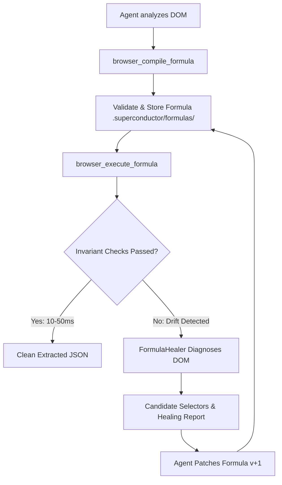

# Superconductor Browser Skill

Autonomous, agent-driven browser automation and intelligence engine for Superconductor and Design OS.

## Overview

The **Superconductor Browser** (`@superconductor/browser`) transitions browser automation from slow, token-heavy, single-pass LLM scraping into an **industrial-grade, deterministic, self-healing execution engine**.

### Core Architecture

- **Compile Once, Execute Fast, Self-Heal on Drift**: AI agents analyze a webpage once to compile a declarative, validated extraction formula (`ScrapeFormula`). Once saved, subsequent executions run natively in Chromium at machine speeds (**10–50ms**, zero token cost). If a site redesign or DOM change breaks extraction assertions, the engine flags `driftDetected: true`, triggers an automated diagnostic pass, and guides the agent to heal and re-save the formula.
- **Client-Side JS State & Hydration Deep Inspection**: Bypasses DOM traversal and layout reflows entirely by plucking structured state directly from memory (`window.__NEXT_DATA__`, `window.WIZ_global_data`, `window.__NUXT__`, `window.__PRELOADED_STATE__`) and network route response streams.
- **Multi-Page Resumable Checkpoints**: Traverses infinite-scroll feeds or paginated catalogs across sessions using an atomic, crash-proof journal (`.superconductor/checkpoints/<job-id>.json`). Guarantees zero duplicate items and seamless recovery from rate limits or network drops.
- **Human Behavioral Stealth Physics**: Natural cubic Bezier cursor curves with micro-overshoot, Gaussian-distributed keystroke flight/dwell latencies, inertial wheel deceleration with reading pauses, and browser fingerprint masking.

---

## When to Use

```
                            ┌─────────────────────────────────────────┐
                            │      What is your browser task?         │
                            └───────────────────┬─────────────────────┘
                                                │
                 ┌──────────────────────────────┼──────────────────────────────┐
                 ▼                              ▼                              ▼
      [Framework App / State]        [Repetitive / Bulk Data]        [Complex Multi-Step UX]
      Next.js, Nuxt, Google WIZ,     Catalogs, feeds, paginated      Interactive forms, logins,
      or direct REST/API payloads    tables, recurring crawls        takeover or dynamic goals
                 │                              │                              │
                 ▼                              ▼                              ▼
      browser_inspect_state          Compile Formula Pipeline               browser_goal
      (Microsecond memory            1. browser_compile_formula             (Autonomous agent
       extraction, no DOM)           2. browser_execute_formula              action loop with
                                     (10-50ms deterministic exec,            human auth bridge)
                                      resumable checkpoints)
```

| Situation / Need | Recommended Tool / Pattern | Why |
| :--- | :--- | :--- |
| Extracting data from Next.js, Nuxt, Redux, or Google WIZ pages | `browser_inspect_state` | 50x faster than DOM parsing; extracts pristine data without formatting noise or missing hidden elements. |
| Crawling hundreds or thousands of items across pages or infinite scroll | `browser_compile_formula` + `browser_execute_formula` | Deterministic 10–50ms page runs, zero token consumption, atomic deduplication via `jobId`. |
| Extracting a single quick article, documentation page, or simple site | `browser_scrape` | Simple one-pass markdown or JSON extraction without compiling a stored recipe. |
| Logging in, handling 2FA, navigating multi-step workflows or popups | `browser_goal` | Full goal-oriented action runner with vision/DOM snapshots and live screencast takeover. |
| High anti-bot protection (Cloudflare, PerimeterX, Datadome, Akamai) | `browser_navigate` with stealth options | Injects natural Bezier curves, realistic keystroke latencies, and fingerprint masking. |

### When NOT to Use
- **Do NOT** use `browser_goal` for bulk pagination or catalog scraping: It burns unnecessary tokens and incurs high latency per page. Use formulas instead.
- **Do NOT** query raw DOM nodes when structured hydration state exists: Always try `browser_inspect_state` first on Next.js/Nuxt sites.
- **Do NOT** perform uncheckpointed multi-page crawls: Always provide a `jobId` so work can be resumed if halted.

---

## Architecture & Core Concepts

### 1. The "Compile Once, Execute Fast, Self-Heal" Paradigm

Single-pass LLM scrapers inspect every single page, incurring massive token costs, latency (5–15 seconds per page), and non-deterministic schema variance.

The Superconductor Formula engine splits extraction into two phases:
1. **Compilation Phase (AI / Agent)**: Analyzes the page DOM, isolates entity clusters, specifies field extraction rules (CSS/XPath, attributes, regex, transforms), and defines invariants (`minItems`, `requiredFields`). The formula is validated with Zod, assigned a SHA-256 checksum, and persisted atomically to [`.superconductor/formulas/<domain-hash>.json`](file:///home/gooseware/repos/gemini/extensions/superconductor/packages/superconductor-browser/src/formula/store.ts).
2. **Execution Phase (Machine)**: Executes the compiled formula natively inside the Chromium page context via [`FormulaExecutor`](file:///home/gooseware/repos/gemini/extensions/superconductor/packages/superconductor-browser/src/formula/executor.ts). It takes **10–50ms**, requires **zero LLM tokens**, and enforces schema invariants on every run.
3. **Self-Healing Phase (On Drift)**: If a site updates its CSS classes or DOM hierarchy, invariant assertions fail. The executor flags `driftDetected: true`, packages a diagnostic report, and prompts the agent with candidate container queries to heal the formula without developer intervention.



---

### 2. Client-Side JS State & Hydration Deep Inspection

Modern web applications hydrate their UI from preloaded JSON blobs stored in memory or embedded `<script>` tags. Parsing the rendered DOM is slow, introduces layout shifts, and often truncates hidden metadata (e.g., product IDs, stock counts, internal timestamps).

[`StateInspector`](file:///home/gooseware/repos/gemini/extensions/superconductor/packages/superconductor-browser/src/inspector/stateInspector.ts) extracts these blobs directly in microseconds:
- **Next.js**: Reads `window.__NEXT_DATA__` or parses `<script id="__NEXT_DATA__">`. Contains the entire page `props.pageProps` tree.
- **Nuxt**: Reads `window.__NUXT__` or `window.__NUXT_DATA__`.
- **Redux / Pinia / Vuex**: Reads `window.__PRELOADED_STATE__` or `window.__INITIAL_STATE__`.
- **Google WIZ / Closure**: Reads `window.WIZ_global_data`, `window.AF_initDataCallback`, and Google data-service requests.
- **Network Route Interception**: [`NetworkInterceptor`](file:///home/gooseware/repos/gemini/extensions/superconductor/packages/superconductor-browser/src/inspector/networkInterceptor.ts) hooks `page.on('response')` to catch raw API JSON responses before they are converted into DOM elements.

---

### 3. Multi-Page Resumable Checkpoints

Crawling large catalogs or infinite scroll feeds requires fault-tolerance. The [`CheckpointManager`](file:///home/gooseware/repos/gemini/extensions/superconductor/packages/superconductor-browser/src/crawler/checkpoint.ts) and [`Traverser`](file:///home/gooseware/repos/gemini/extensions/superconductor/packages/superconductor-browser/src/crawler/traverser.ts) provide:
- **Deduplication Engine**: Tracks `completedIds` in a high-speed set to skip previously extracted records.
- **Cursor Tracking**: Persists `pageIndex`, `scrollOffset`, and `lastSeenId`.
- **Atomic Journaling**: Uses temp file writes + atomic rename (`fs.renameSync`) to ensure checkpoints in `.superconductor/checkpoints/<job-id>.json` are never corrupted if the process terminates abruptly.
- **Traversal Modes**:
  - `infinite_scroll`: Uses `MutationObserver` to wait for dynamic DOM insertion after scrolling, with configurable retries, scroll deltas, and reading delays.
  - `paginate_links`: Follows pagination links (`a[rel="next"]`, `.pagination-next`, or numeric button selectors) until end of catalog or `maxPages`.

---

### 4. Human Behavioral Stealth Physics

Naive headless automation triggers bot-detection (Cloudflare Turnstile, Datadome, PerimeterX) due to synthetic movement patterns: perfectly straight mouse lines, uniform typing speeds, and instantaneous scrolling.

The Superconductor Stealth engine models biological human mechanics:
- **Mouse Dynamics ([`MousePhysics`](file:///home/gooseware/repos/gemini/extensions/superconductor/packages/superconductor-browser/src/stealth/mousePhysics.ts))**:
  - Cubic Bezier trajectories with randomized control points offset perpendicular to the motion axis.
  - Non-linear velocity curves (`easeInOutCubic`) simulating muscle acceleration, mid-flight velocity, and deceleration near target.
  - Sub-pixel micro-jitter and realistic overshoots with corrective adjustments.
- **Typing Dynamics ([`HumanInput`](file:///home/gooseware/repos/gemini/extensions/superconductor/packages/superconductor-browser/src/stealth/humanInput.ts))**:
  - Gaussian-distributed flight time (delay between consecutive keypresses: 60–140ms).
  - Gaussian-distributed dwell time (how long each key is held down: 30–50ms).
  - Simulated typographical errors based on physical QWERTY keyboard neighbor keys, followed by natural pause and backspace correction.
- **Inertial Wheel Scrolling**:
  - Mouse-wheel delta deceleration matching inertial trackpad/wheel physics.
  - Simulated reading pauses (saccades) at regular intervals.
- **Runtime Fingerprint Masking ([`FingerprintSpoofer`](file:///home/gooseware/repos/gemini/extensions/superconductor/packages/superconductor-browser/src/stealth/fingerprint.ts))**:
  - Erases `navigator.webdriver`.
  - Injects realistic `window.chrome` runtime APIs.
  - Aligns hardware concurrency, device memory, WebGL vendor strings, and viewport dimensions.

---

## Tool Reference

The Superconductor Browser MCP Server exposes the following tools:

### `browser_navigate`
Navigates using stealth Chromium and returns page title and status.
```typescript
interface BrowserNavigateInput {
  url: string;
  stealth?: boolean;            // Defaults to true
}
```

### `browser_inspect_state`
Uses StateInspector to extract hydration data (__NEXT_DATA__, Google WIZ data, JSON-LD) or window global path.
```typescript
interface BrowserInspectStateInput {
  url: string;
  path?: string;                // Window global property path to inspect (e.g. appState.user)
}
```

### `browser_compile_formula`
Navigates, analyzes DOM patterns using FormulaCompiler, compiles a ScrapeFormula, saves it via FormulaStore, and returns the compiled formula JSON.
```typescript
interface BrowserCompileFormulaInput {
  url: string;
  itemSelector?: string;        // Optional item container selector
  fields?: Record<string, any>; // Optional field extraction rules
  sampleLimit?: number;         // Optional sample count limit
  invariants?: {
    minItems?: number;
    maxItems?: number;
    requiredFields?: string[];
  };
}
```

### `browser_execute_formula`
Runs FormulaExecutor, coordinating with MultiPageTraverser and CheckpointManager if multi-page/resume is requested. If drift is detected, returns FormulaDriftEvent and FormulaHealer diagnostics.
```typescript
interface BrowserExecuteFormulaInput {
  url: string;
  formulaId?: string;
  formula?: Record<string, any>;
  strategy?: 'paginate' | 'infinite_scroll'; // Traversal strategy (defaults to 'paginate')
  scrollContainerSelector?: string;          // Optional scroll container selector when strategy is infinite_scroll
  maxPages?: number;                         // Maximum pages or scrolls to traverse
  resume?: boolean;                          // Whether to resume traversal from checkpoint
  jobId?: string;                            // Checkpoint job ID
}
```

### `browser_scrape`
Uses DualScraper to extract clean GFM Markdown or structured JSON records.
```typescript
interface BrowserScrapeInput {
  url: string;
  mode?: 'read' | 'scrape';     // Defaults to 'read' (GFM Markdown) or 'scrape' (structured JSON)
  schema?: Record<string, any>; // Extraction schema when mode is 'scrape'
}
```

### `browser_goal`
Uses JevRunner to autonomously execute the goal and returns action trace and final result.
```typescript
interface BrowserGoalInput {
  url: string;
  goal: string;
  maxSteps?: number;            // Maximum autonomous steps to execute (defaults to 20)
}
```

---

## Practical Workflows & Code Examples

### Workflow 1: Microsecond Data Extraction via Hydration State

On modern React/Next.js/Nuxt platforms, skip DOM parsing entirely and read the hydration tree.

```typescript
// 1. Navigate to target
await call_mcp_tool({
  ServerName: 'superconductor-browser',
  ToolName: 'browser_navigate',
  Arguments: {
    url: 'https://example-nextjs-ecommerce.com/products',
  },
  toolAction: 'Navigating to catalog',
  toolSummary: 'Navigate to target store'
});

// 2. Inspect hydration state
const stateResult = await call_mcp_tool({
  ServerName: 'superconductor-browser',
  ToolName: 'browser_inspect_state',
  Arguments: {
    url: 'https://example-nextjs-ecommerce.com/products',
  },
  toolAction: 'Extracting hydration state',
  toolSummary: 'Extract Next.js pageProps'
});

// Result contains hydration and JSON-LD data:
// stateResult.hydration.next.props.pageProps.products -> Array of 48 typed product objects
```

---

### Workflow 2: Compiling & Executing a Scrape Formula

When scraping regular HTML catalogs or tables repeatedly, compile a formula once.

#### Step 1: Compile the Formula
```json
{
  "domain": "news.ycombinator.com",
  "name": "frontpage_submissions",
  "version": 1,
  "itemSelector": "tr.athing",
  "fields": {
    "title": {
      "type": "string",
      "selector": "span.titleline > a",
      "required": true
    },
    "url": {
      "type": "url",
      "selector": "span.titleline > a",
      "attribute": "href",
      "required": true
    },
    "rank": {
      "type": "number",
      "selector": "span.rank",
      "regex": "\\d+"
    }
  },
  "invariants": {
    "minItems": 25,
    "maxItems": 35,
    "requiredFields": ["title", "url"]
  }
}
```

Call `browser_compile_formula`:
```typescript
await call_mcp_tool({
  ServerName: 'superconductor-browser',
  ToolName: 'browser_compile_formula',
  Arguments: {
    url: 'https://news.ycombinator.com',
    itemSelector: 'tr.athing',
    fields: {
      title: { type: 'string', selector: 'span.titleline > a', required: true },
      url: { type: 'url', selector: 'span.titleline > a', attribute: 'href', required: true },
      rank: { type: 'number', selector: 'span.rank', regex: '\\d+' }
    },
    invariants: {
      minItems: 25,
      maxItems: 35,
      requiredFields: ['title', 'url']
    }
  },
  toolAction: 'Compiling scrape formula',
  toolSummary: 'Compile HN frontpage formula'
});
```

#### Step 2: Deterministic Fast Execution
```typescript
const result = await call_mcp_tool({
  ServerName: 'superconductor-browser',
  ToolName: 'browser_execute_formula',
  Arguments: {
    url: 'https://news.ycombinator.com',
    formulaId: 'news_ycombinator_com_frontpage_submissions_v1',
  },
  toolAction: 'Executing formula',
  toolSummary: 'Execute frontpage extraction'
});

// result.data contains 30 items
// result.executionTimeMs = 14.8ms
// result.driftDetected = false
```

---

### Workflow 3: Multi-Page Traversal with Checkpoint Resumption

For feeds or paginated sites, pass `jobId` and `strategy`.

```typescript
const crawlResult = await call_mcp_tool({
  ServerName: 'superconductor-browser',
  ToolName: 'browser_execute_formula',
  Arguments: {
    url: 'https://acme-store.com/products',
    formulaId: 'acme_store_products_v1',
    jobId: 'crawl_acme_autumn_sale_2026',
    strategy: 'paginate',
    maxPages: 20,
    resume: true // Safe to rerun; skips already processed IDs
  },
  toolAction: 'Crawling multi-page catalog',
  toolSummary: 'Run resumable catalog crawl'
});
```

If the crawler stops at page 12 due to a network disruption, re-invoking the exact same call with `resume: true` resumes at page 12 without re-extracting items from pages 1–11.

---

### Workflow 4: The Self-Healing Loop

When site DOM changes cause invariant violations, the engine detects drift and assists in self-healing.

```typescript
// 1. Execute formula
const execResult = await call_mcp_tool({
  ServerName: 'superconductor-browser',
  ToolName: 'browser_execute_formula',
  Arguments: {
    url: 'https://acme-store.com/products',
    formulaId: 'acme_store_products_v1'
  },
  toolAction: 'Executing formula',
  toolSummary: 'Run store extraction'
});

// 2. Check for drift
if (execResult.driftDetected) {
  // execResult.driftEvent:
  // {
  //   missingSelectors: ['span.product-price'],
  //   emptyRequiredFields: ['price'],
  //   reason: 'Invariant violation: missingSelectors: span.product-price'
  // }

  // 3. Inspect target page DOM or diagnosis hints
  // The executor returns suggested candidate selectors from surrounding clusters
  // (e.g., 'span.price-tag-v2' replaced 'span.product-price')

  // 4. Compile updated formula (version bump v2)
  await call_mcp_tool({
    ServerName: 'superconductor-browser',
    ToolName: 'browser_compile_formula',
    Arguments: {
      url: 'https://acme-store.com/products',
      itemSelector: 'div.product-card',
      fields: {
        title: { type: 'string', selector: 'h3.product-title', required: true },
        price: { type: 'string', selector: 'span.price-tag-v2', required: true }, // Healed selector
        url: { type: 'url', selector: 'a.product-link', attribute: 'href', required: true }
      },
      invariants: {
        minItems: 10,
        requiredFields: ['title', 'price']
      }
    },
    toolAction: 'Healing formula',
    toolSummary: 'Compile v2 with healed price selector'
  });

  // 5. Re-execute with healed formula
  const healedResult = await call_mcp_tool({
    ServerName: 'superconductor-browser',
    ToolName: 'browser_execute_formula',
    Arguments: {
      url: 'https://acme-store.com/products',
      formulaId: 'acme_store_com_products_v1'
    },
    toolAction: 'Executing healed formula',
    toolSummary: 'Run healed extraction'
  });
}
```

---

## Best Practices & Anti-Patterns

### ✅ Best Practices
1. **Always Check Hydration First**: Before building complex CSS selectors, run `browser_inspect_state`. Over 60% of modern web apps expose pristine JSON in Next.js/Nuxt state.
2. **Set Sensible Invariants**: Always configure `minItems` (e.g., 5) and `requiredFields` in your formulas. This ensures silent site breakages immediately trigger self-healing rather than quietly returning empty arrays.
3. **Use Meaningful `jobId`s**: Group crawls by business entity and date (e.g., `jobId: "ebay_vintage_watches_202610"`). This enables clean resumes and checkpoint inspection.
4. **Leverage Stealth by Default**: Keep stealth enabled during navigation to avoid Cloudflare/Akamai bot friction.

### ❌ Anti-Patterns
1. **The LLM Loop Trap**: Calling `browser_goal` or single-pass LLM prompts 50 times in a row to scrape 50 pages. This is 100x slower, expensive, and fragile. Compile a formula once and run `browser_execute_formula` with `strategy: 'paginate'` or `'infinite_scroll'`.
2. **Brittle nth-child Selectors**: Avoid selectors like `div > div:nth-child(3) > table > tr > td:nth-child(2)`. Favor semantic classes (`.price`, `span[data-testid="item-price"]`, or XPath relative queries).
3. **Ignoring Drift Warnings**: Never suppress or ignore `driftDetected: true`. When drift occurs, update the formula immediately so future automated runs stay healthy.

---

## Key Source File Links

- **Formula Engine**:
  - Compiler: [`packages/superconductor-browser/src/formula/compiler.ts`](file:///home/gooseware/repos/gemini/extensions/superconductor/packages/superconductor-browser/src/formula/compiler.ts)
  - Executor: [`packages/superconductor-browser/src/formula/executor.ts`](file:///home/gooseware/repos/gemini/extensions/superconductor/packages/superconductor-browser/src/formula/executor.ts)
  - Healer: [`packages/superconductor-browser/src/formula/healer.ts`](file:///home/gooseware/repos/gemini/extensions/superconductor/packages/superconductor-browser/src/formula/healer.ts)
  - Store: [`packages/superconductor-browser/src/formula/store.ts`](file:///home/gooseware/repos/gemini/extensions/superconductor/packages/superconductor-browser/src/formula/store.ts)
  - Types & Schemas: [`packages/superconductor-browser/src/formula/types.ts`](file:///home/gooseware/repos/gemini/extensions/superconductor/packages/superconductor-browser/src/formula/types.ts)
- **State & Network Inspection**:
  - Hydration State Inspector: [`packages/superconductor-browser/src/inspector/stateInspector.ts`](file:///home/gooseware/repos/gemini/extensions/superconductor/packages/superconductor-browser/src/inspector/stateInspector.ts)
  - Network Interceptor: [`packages/superconductor-browser/src/inspector/networkInterceptor.ts`](file:///home/gooseware/repos/gemini/extensions/superconductor/packages/superconductor-browser/src/inspector/networkInterceptor.ts)
- **Crawler & Checkpoints**:
  - Checkpoint Manager: [`packages/superconductor-browser/src/crawler/checkpoint.ts`](file:///home/gooseware/repos/gemini/extensions/superconductor/packages/superconductor-browser/src/crawler/checkpoint.ts)
  - Multi-Page Traverser: [`packages/superconductor-browser/src/crawler/traverser.ts`](file:///home/gooseware/repos/gemini/extensions/superconductor/packages/superconductor-browser/src/crawler/traverser.ts)
- **Behavioral Stealth**:
  - Mouse Physics & Bezier Trajectories: [`packages/superconductor-browser/src/stealth/mousePhysics.ts`](file:///home/gooseware/repos/gemini/extensions/superconductor/packages/superconductor-browser/src/stealth/mousePhysics.ts)
  - Human Keystroke Cadence & Inertial Scroll: [`packages/superconductor-browser/src/stealth/humanInput.ts`](file:///home/gooseware/repos/gemini/extensions/superconductor/packages/superconductor-browser/src/stealth/humanInput.ts)
  - Fingerprint Spoofing: [`packages/superconductor-browser/src/stealth/fingerprint.ts`](file:///home/gooseware/repos/gemini/extensions/superconductor/packages/superconductor-browser/src/stealth/fingerprint.ts)
