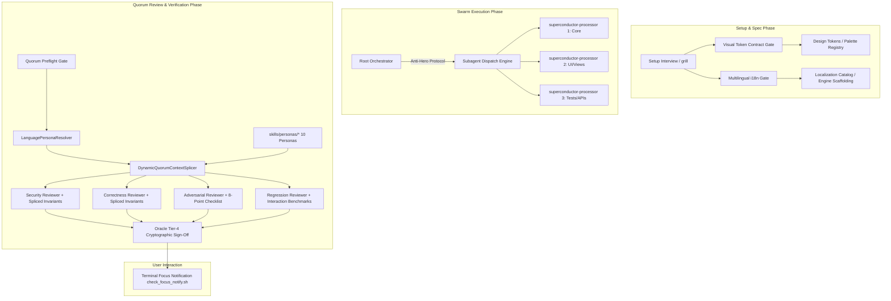

# Specification: Multi-Language Persona Skills Architecture, Setup Dogma & Swarm Guardrails

**Track ID:** `multi_language_persona_architecture_20260820`  
**Type:** Feature / Architectural Enhancement  
**Status:** Planned  
**Created:** 2026-08-20  
**Target Branch:** `main`  
**Track Branch:** `track/multi_language_persona_architecture_20260820`  
**Tier:** 4  

---

## 1. Overview & Executive Summary

Superconductor is a language-agnostic, framework-agnostic spec-driven autonomous multi-agent engineering platform. Whether a target repository is built in **Rust, Go, Python, Swift, TypeScript/JavaScript, C++, C#/.NET, Kotlin, Zig**, or multi-platform UI frameworks (**Slint, Iced, Tauri, SwiftUI, Jetpack Compose, Flutter, Qt/QML, Fyne, React/Next.js**), the orchestration lifecycle must enforce rigorous setup discovery, domain subagent delegation, automated design/contract compliance, and quorum review standards.

This track synthesizes the deep research findings from `RECOMMENDED_FIXES.md` (v3.0.0) into production-grade platform enhancements across seven major architectural pillars:
1. **Visual Language, Theme Architecture & Token Contract Lock-In**: Mandatory setup gate requiring selection of explicit semantic tokens and zero hardcoded style literals in user-facing code.
2. **Upfront Multilingual & Localization (i18n / l10n) Discovery Gate**: Early-stage interview protocol ensuring internationalization is scaffolded on Day 1 or explicitly excluded.
3. **Anti-Hero-Agent Protocol (Root Orchestration Dogma)**: Hard guardrails strictly forbidding the root orchestrator from directly modifying production files during swarm execution.
4. **Modular Language Persona Skills Architecture**: 10 dedicated, high-fidelity reviewer persona skills housed under `skills/personas/` encapsulating deep language idioms, memory safety rules, concurrency models, and runtime anti-patterns.
5. **Dynamic Quorum Context Splicer Engine**: `@superconductor/core` engine modules (`LanguagePersonaResolver` and `DynamicQuorumContextSplicer`) that automatically detect project technology stacks and inject stack-specific review rubrics into the 4 Universal Quorum Reviewers.
6. **UI Layering & Event Hit-Testing Dogma**: Universal front-end standard mandating explicit pointer/touch hit-testing configuration for floating overlays, viewports, and HUDs.
7. **Terminal Focus Notification Protocol**: Automated platform integration notifying developers when long-running subagent swarms complete or require interactive feedback.

---

## 2. Problem Statement & Motivation

Prior iterations of the Superconductor framework faced several subtle failure modes when operating on diverse tech stacks and large-scale multi-agent runs:

1. **Styling Churn & Hardcoded Literals**: Without early token contract lock-in, agents generated divergent hex codes, raw RGB values, and magic spacing constants across UI views, requiring costly refactoring passes.
2. **Post-Hoc Internationalization Refactoring**: Retrofitting i18n catalogs into hundreds of monolingual components caused regressions, broken templates, and immense token waste.
3. **Hero-Agenting & Context Window Contamination**: Root orchestrators occasionally executed direct code edits instead of delegating to domain subagents (`superconductor-processor`), defeating subagent isolation, cluttering context, and skipping independent verification.
4. **Homogeneous Quorum Blind Spots**: Reviewers evaluated code with generic heuristics rather than stack-native idioms (e.g., missing Go goroutine context leaks, Rust unsafe lifetime aliasing, Swift ARC retain cycles, or Python async event loop blocking).
5. **UI Layer Hit-Testing Interceptions**: Subagents built floating action bars, story carousels, and modal overlays that visually rendered correctly but intercepted or swallowed touch/mouse events due to missing `pointer-events` or `allowsHitTesting` configurations.
6. **Silent Swarm Completion**: Users context-switched away during 10-minute swarm runs without receiving prompt desktop or terminal focus notifications upon completion.

---

## 3. Architecture & System Design

### 3.1 Visual Language & Token Contract Gate
- Enforced in `skills/setup/SKILL.md` and `skills/grill/SKILL.md`.
- At project initialization, the agent prompts and locks down the visual token contract:
  - **CSS/Web**: CSS Custom Properties, Tailwind tokens, CSS Modules, or Design Tokens JSON.
  - **Rust**: Palette structs, theme resources, or design token constants (Slint/Iced/Tauri).
  - **Go**: Theme interfaces, canvas resource constants, or CSS token variables (Fyne/Templ).
  - **Python**: QSS stylesheets, theme palettes, or design token dictionaries (PyQt/Flet/NiceGUI).
  - **Mobile/Native**: Asset Catalogs, `ColorScheme`, or `ThemeData` tokens (SwiftUI/Compose/Flutter).
  - **C++**: Style sheets, palette definitions, or theme configuration files (Qt/ImGui).
- Universal Semantic Token Contract defines 4 required categories:
  1. *Surfaces & Backgrounds* (base background, elevated surface, subtle container).
  2. *Content & Typography* (primary text/icons, secondary/muted text, inverted text).
  3. *Brand & State* (primary/accent, borders/dividers, success, warning, error).
  4. *Geometry & Spacing* (container radius, element radius, standardized spacing scale).
- Automated static linting / regex checks verify 0 raw hex literals or untokenized inline values in views.

### 3.2 Upfront Multilingual / i18n Discovery Gate
- Enforced in `skills/setup/SKILL.md`, `skills/to-spec/SKILL.md`, and `skills/grill/SKILL.md`.
- Explicit interview question: *"Will this application need to support multiple languages, international locales, right-to-left (RTL) scripts, or localized formatting now or in the future?"*
- If **Yes**: Immediately scaffolds stack-appropriate localization library (e.g. `fluent-rs`, `golang.org/x/text`, `gettext`/`Babel`, `IStringLocalizer`, `.xcstrings`, Android `strings.xml`, `flutter_localizations`, `@lingui/core` / `next-intl`). User-facing strings must use localization macros/wrappers from the very first task.
- If **No**: Formally documents the monolingual invariant in `superconductor/project.md` and track specs to prevent unnecessary localization overhead.

### 3.3 Anti-Hero-Agent Protocol
- Enforced in `skills/implement/SKILL.md` and `skills/swarm-execute/SKILL.md`.
- **Root Orchestration Dogma**:
  1. The Root Agent is an **Orchestrator and Conductor**, not an individual contributor.
  2. Direct edits on product code files by the Root Agent are **PROHIBITED** during Swarm Execution.
  3. Every plan phase MUST be delegated to one or more specialized `superconductor-processor` subagents.
  4. Quorum reviews MUST be conducted by parallel `superconductor-reviewer` subagents.
  5. Remediation loops triggered by `NEEDS_FIXES` MUST dispatch isolated remediator subagents.

### 3.4 Modular Language Persona Skills Architecture
10 modular persona skills located in `skills/personas/`:
1. `skills/personas/rust-reviewer/SKILL.md`: Memory safety, borrow checker aliasing, unsafe block justification, zero-cost abstractions, error handling (`Result`/`Option`), Cargo clippy/audit rules.
2. `skills/personas/go-reviewer/SKILL.md`: Goroutine lifecycle & leak prevention, `context.Context` cancellation propagation, error wrapping (`fmt.Errorf("%w")`), race detector compliance (`-race`), table-driven tests, channel synchronization.
3. `skills/personas/python-reviewer/SKILL.md`: GIL & async event loop starvation, type hints & strict mypy compliance, pytest fixtures & mock hygiene, mutable default arguments, packaging & virtualenv isolation.
4. `skills/personas/swift-reviewer/SKILL.md`: ARC retain cycle elimination (`[weak self]`), Swift Concurrency (`Sendable`, Actor isolation), SwiftUI view body purity, value vs reference semantics, `.xcstrings` localization compliance.
5. `skills/personas/typescript-reviewer/SKILL.md`: Strict type soundness (no `any`/unsound type assertions), nullability safety, async promise error handling, DOM/SSR hydration safety, bundle tree-shaking footprint.
6. `skills/personas/cpp-reviewer/SKILL.md`: RAII resource management, pointer arithmetic & dangling references, UB sanitizers (ASan/UBSan), smart pointer semantics (`std::unique_ptr`/`std::shared_ptr`), move semantics, exception safety.
7. `skills/personas/csharp-reviewer/SKILL.md`: `IDisposable` pattern, async/await task deadlock prevention (`ConfigureAwait`), LINQ allocation overhead, nullable reference types (`#nullable enable`), thread safety.
8. `skills/personas/kotlin-reviewer/SKILL.md`: Coroutine scope hierarchy, structured concurrency cancellation, platform types & nullability, Android/JVM performance, inline value classes.
9. `skills/personas/zig-reviewer/SKILL.md`: Explicit allocator parameterization, comptime metaprogramming type verification, error set handling, undefined memory safety, zero-hidden-allocation dogma.
10. `skills/personas/ui-layout-reviewer/SKILL.md`: Layer hit-testing & pointer events, viewport responsiveness across breakpoints, WCAG 2.1 AA accessibility & contrast, token contract adherence, touch target minimums (48x48dp).

### 3.5 Dynamic Quorum Context Splicer Engine
Located in `packages/superconductor-core/src/review/` and `packages/superconductor-core/src/swarm/`:
- `LanguagePersonaResolver`: Inspects `tech-stack.md`, project manifests (`Cargo.toml`, `go.mod`, `pyproject.toml`, `Package.swift`, `package.json`, `CMakeLists.txt`, `*.csproj`, `build.gradle.kts`, `build.zig`), and source file extensions to resolve the active primary language and UI framework.
- `DynamicQuorumContextSplicer`: Reads corresponding persona definitions from `skills/personas/<persona>/SKILL.md` and dynamically splices stack-specific invariant checklists into the prompt payloads of the 4 Quorum Reviewers (Security, Correctness, Adversarial, Regression).

### 3.6 UI Layer Hit-Testing Dogma
Enforced in `skills/design-heuristics/SKILL.md` and `skills/superconductor-kernel-dogma/SKILL.md`:
- Interactive subcomponents placed inside pass-through overlay containers or floating viewports MUST explicitly enable event hit-testing:
  - *Web / CSS*: `pointer-events: auto;` (with parent `pointer-events: none;`)
  - *Flutter*: `HitTestBehavior.opaque` / `IgnorePointer(ignoring: false)`
  - *SwiftUI*: `.allowsHitTesting(true)` / `.contentShape(Rectangle())`
  - *Jetpack Compose*: `Modifier.pointerInput(...)` / explicit clickable surfaces
  - *Qt / QML*: `MouseArea { enabled: true }` / `acceptedMouseButtons`
  - *Godot / Game Engines*: `mouse_filter = MOUSE_FILTER_STOP`
- Test suites must include automated simulated pointer/tap interactions on all overlay elements.

### 3.7 Terminal Focus Notification Protocol
Enforced in `skills/swarm-execute/SKILL.md` and `skills/implement/SKILL.md`:
- Orchestrator invokes `check_focus_notify.sh` before entering wait states or concluding a track.
- If terminal window is not active/focused, triggers desktop notifications (`notify-send`, system sound, or OS alert) with track status and pending action summary.

---

## 4. Functional Requirements

- **FR-1: Visual Language Discovery Gate**: `skills/setup/SKILL.md` and `skills/grill/SKILL.md` must implement visual token discovery, semantic scale lock-in, and static style linting rules.
- **FR-2: Multilingual i18n Discovery Gate**: `skills/setup/SKILL.md`, `skills/to-spec/SKILL.md`, and `skills/grill/SKILL.md` must prompt for multi-language support and scaffold stack-appropriate localization infrastructure.
- **FR-3: Root Orchestrator Anti-Hero Dogma**: `skills/implement/SKILL.md` and `skills/swarm-execute/SKILL.md` must mandate subagent dispatch via `superconductor-processor` and ban root-level code authoring.
- **FR-4: 10 Modular Persona Skills**: Create `skills/personas/` with all 10 reviewer skills containing strict domain rubrics, anti-patterns, and verification checklists.
- **FR-5: LanguagePersonaResolver**: Implement resolver in `@superconductor/core` supporting Rust, Go, Python, Swift, TypeScript, C++, C#, Kotlin, Zig, and UI layouts with manifest + file-tree heuristics.
- **FR-6: DynamicQuorumContextSplicer**: Implement context splicer in `@superconductor/core` injecting resolved language persona invariants into the 4 Quorum Reviewer prompt payloads.
- **FR-7: UI Layer Hit-Testing Standard**: `skills/design-heuristics/SKILL.md` and `skills/superconductor-kernel-dogma/SKILL.md` must document explicit hit-testing rules across all 6 UI framework families.
- **FR-8: Terminal Focus Notification Integration**: `skills/swarm-execute/SKILL.md` and `skills/implement/SKILL.md` must define the focus check and desktop notification protocol.

---

## 5. Non-Functional Requirements

- **NFR-1 (Language Agnosticism)**: Quorum and setup mechanics must operate seamlessly across all 9 supported languages without hardcoded JavaScript/TypeScript assumptions.
- **NFR-2 (Zero Context Bloat)**: Splicer engine must inject only relevant persona invariants for the active tech stack, keeping prompt tokens minimal and focused.
- **NFR-3 (Subagent Isolation)**: Subagents must operate in isolated child contexts, returning structured findings blocks without parent pollution.
- **NFR-4 (Deterministic Persona Resolution)**: `LanguagePersonaResolver` must produce deterministic, cached results with zero network calls and sub-5ms resolution time.
- **NFR-5 (Backward Compatibility)**: Existing projects without `skills/personas/` must gracefully fall back to generic quorum reviewer profiles without error.

---

## 6. Acceptance Criteria

| ID | Criterion | Verification Target |
|---|---|---|
| **AC-1** | Visual Language & Token Contract Gate is fully documented and enforced in `skills/setup/SKILL.md` and `skills/grill/SKILL.md`, requiring 4-tier semantic token architecture and automated linting. | `skills/setup/SKILL.md`, `skills/grill/SKILL.md` |
| **AC-2** | Upfront Multilingual / i18n Discovery Gate is documented and enforced in `skills/setup/SKILL.md`, `skills/to-spec/SKILL.md`, and `skills/grill/SKILL.md` with explicit prompt and framework catalog. | `skills/setup/SKILL.md`, `skills/to-spec/SKILL.md`, `skills/grill/SKILL.md` |
| **AC-3** | Anti-Hero-Agent Protocol and Root Orchestration Dogma are codified in `skills/implement/SKILL.md` and `skills/swarm-execute/SKILL.md`, strictly prohibiting direct code editing in root agent session. | `skills/implement/SKILL.md`, `skills/swarm-execute/SKILL.md` |
| **AC-4** | All 10 modular language persona skills (`rust-reviewer`, `go-reviewer`, `python-reviewer`, `swift-reviewer`, `typescript-reviewer`, `cpp-reviewer`, `csharp-reviewer`, `kotlin-reviewer`, `zig-reviewer`, `ui-layout-reviewer`) are created under `skills/personas/` with exhaustive review checklists. | `skills/personas/**/SKILL.md` |
| **AC-5** | `LanguagePersonaResolver` is implemented in `packages/superconductor-core/src/swarm/LanguagePersonaResolver.ts` with accurate detection for all 9 programming languages plus UI layout framework detection. | `packages/superconductor-core/src/swarm/LanguagePersonaResolver.ts` |
| **AC-6** | `DynamicQuorumContextSplicer` is implemented in `packages/superconductor-core/src/swarm/DynamicQuorumContextSplicer.ts` and correctly splices persona rubrics into Quorum Reviewer prompt payloads. | `packages/superconductor-core/src/swarm/DynamicQuorumContextSplicer.ts` |
| **AC-7** | UI Layer Hit-Testing Dogma is integrated into `skills/design-heuristics/SKILL.md` and `skills/superconductor-kernel-dogma/SKILL.md`, specifying explicit pointer event / hit testing rules across Web, Flutter, SwiftUI, Compose, Qt, and Godot. | `skills/design-heuristics/SKILL.md`, `skills/superconductor-kernel-dogma/SKILL.md` |
| **AC-8** | Terminal Focus Notification Protocol is documented in `skills/swarm-execute/SKILL.md` and `skills/implement/SKILL.md` with script fallback integration. | `skills/swarm-execute/SKILL.md`, `skills/implement/SKILL.md` |
| **AC-9** | Unit and integration test suites for `LanguagePersonaResolver` and `DynamicQuorumContextSplicer` pass with 100% success rate in `packages/superconductor-core`. | `packages/superconductor-core/tests/` |
| **AC-10** | Skills catalog `skills/catalog.md`, `plugin.json`, and `gemini-extension.json` are updated to register the new persona skills and capabilities. | `skills/catalog.md`, `plugin.json`, `gemini-extension.json` |

---

## 7. Out of Scope

- Implementing third-party compiler toolchains or linters directly in `@superconductor/core` (we invoke native tooling e.g. `cargo clippy`, `golangci-lint`, `ruff`, `swiftlint`).
- Writing proprietary i18n translation services (we scaffold industry-standard formats and libraries).
- GUI window manager focus hooking beyond POSIX/X11/Wayland/macOS focus detection scripts.
